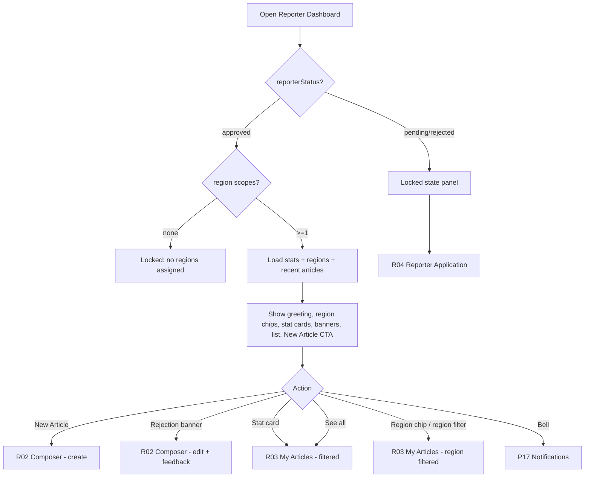

# R01 — Reporter Dashboard

## Metadata

| Field | Value |
|---|---|
| Page ID | R01 |
| Platforms | Mobile / Web |
| Roles | Reporter (approved + pending approval) |
| Priority | P1 |
| Route / Path | Mobile: `ReporterTab → Dashboard`; Web: `/reporter` |
| Prototype | `prototypes/web/r01-reporter-dashboard.html`, `prototypes/mobile/r01-reporter-dashboard.html` |

## Purpose

The Reporter Dashboard is the home surface for the Reporter role. It gives a
reporter an at-a-glance view of their authoring activity: a personalised
greeting, headline stats (published, pending, drafts, total views and likes),
a recent-articles list, a persistent "New Article" primary CTA, and actionable
notifications for article approvals and rejections with the admin's reason.
It also shows the reporter's **assigned regions** (the State → District →
Constituency → Mandal scopes they may author in, per `reporter_region_scopes`
and REQ-REG-002) and lets the recent-articles list be filtered by region.
It is also the gate for Reporter onboarding: users whose application is still
pending (or rejected) see a locked dashboard explaining their status and the
next step instead of authoring controls. A reporter who is approved but has
**no region scope assigned** is likewise locked and cannot author until an
admin (or super admin) assigns at least one region.

## UI Structure

### Mobile

Region-by-region, top to bottom inside the standard `s02` shell (bottom tab bar,
header `header-height-mobile` = 62px).

1. **Header** — `--white` surface, bottom border `--border`. Left: page title
   "Reporter Dashboard" (`font-size-title-sm`, `weight-bold`, `--text`). Right:
   notification bell icon (24px, `--text`) with an unread count badge
   (`--error` fill, `--white` text, `radius-pill`), and the user avatar
   (`avatar` = 27px, `radius-pill`).
2. **Greeting block** — content padding 16px. Line 1: "Hello, {firstName}"
   (`font-size-title`, `weight-extrabold`, `--text`). Line 2: relative date +
   role chip. Reporter role chip uses `--purple-light` background,
   `--purple-tint-border` border, `--purple` text, `radius-sm`. Pending/rejected
   chip uses `--warning` / `--error` tint respectively.
3. **Stats cards grid** — 2×2 grid (`space-3` gutters) of `--white` cards,
   `radius-xl`, `shadow-card`, padding `space-4`.
   - Published (`--success` accent), Pending (`--warning`), Drafts (`--muted`),
     Total views (with likes shown as a secondary line or a 5th combined card).
   - Each card: label (`font-size-meta`, `--muted`, uppercase), value
     (`font-size-title-sm`, `weight-extrabold`, `--text`), and a small delta
     line ("▲ 12% this week", `--success` / `--error`).
4. **Assigned regions summary** — section header "My regions" (`font-size-meta`,
   `--muted`, uppercase) with a count chip. A horizontally scrollable row of
   region **chips**, one per assigned scope, showing the full path
   (`State › District › Constituency › Mandal`) of the most specific scoped
   node, with a level icon per type. Chip style: `--purple-light` fill,
   `--purple-tint-border` border, `--purple` text, `radius-sm`. Tapping a chip
   opens R03 filtered to that region. If a scope is broad (e.g. a State), the
   chip shows the state name with a "State" level tag. When no scopes are
   assigned, this region is replaced by an inline `--warning` note "No regions
   assigned yet" with helper copy "An admin must assign your regions before you
   can write" (see locked state).
5. **Notifications / action banner** — stacked banners for rejection and
   approval events (most recent first, max 3 inline, "View all" → P17). Rejected
   banner: `--purple-light`/`--error` left accent bar, `radius-md`, title
   "Article rejected", body reason excerpt, CTA "Fix & resubmit". Approved
   banner: `--success` accent, CTA "View published".
6. **Recent articles list** — section header "Recent articles" with "See all"
   link (`--purple`, `font-size-nav`). Below the header, a **region filter**
   (horizontal chip row or a "Region: All ▾" dropdown on narrow screens) whose
   options are "All regions" plus the reporter's assigned regions; the selected
   filter is passed to the list query. Rows: thumbnail (56px, `radius-md`,
   placeholder on missing), title (2-line clamp, `weight-semibold`), status
   badge, **region chip** (most specific region name, `--muted` text), relative
   updated time (`font-size-meta`, `--muted`). Max 5 rows.
7. **Sticky primary CTA** — full-width "New Article" button, `--purple` fill,
   `--white` label, `radius-md`, pinned above the bottom tab bar with safe-area
   padding.
8. **Locked state (pending/rejected/unscoped reporter)** — replaces regions 3–7:
   a lock illustration, status heading, explanatory copy, and a single secondary
   CTA ("View application" → R04). Shown when the application is `pending` or
   `rejected`, **or** when the reporter is approved but has no region scope. In
   the no-region case the copy reads "No regions assigned" and the CTA is a
   secondary "Contact support"/info action (admins assign regions at A06).

Component list: `ReporterHeader`, `AvatarButton`, `NotificationBell`,
`RoleChip`, `StatCard`, `StatusBanner`, `RecentArticleRow`, `StatusBadge`,
`RegionChip`, `RegionSummary`, `RegionFilter`, `PrimaryButton`,
`LockedStatePanel`, `SkeletonCard`, `EmptyState`.

### Web

- Top header (`header-height-web` = 68px) from the `s02` shell; content area
  "Reporter" in the header nav (active = `--purple`, 2px underline).
- Content container centered, max-width `content-max-width` (900px) with
  `space-9` vertical padding and `--background`.
- Stats rendered as a **single 4-across row** of cards (not 2×2). Directly under
  the stats, the **assigned-regions summary** renders as a wrapped chip row
  (only wrapping on web) with the same `RegionChip` styling and an "All
  regions" filter control for the list. Below it a two-column layout: left
  column (≈62%) recent-articles list with the region filter inline in its
  section header; right column (≈38%) notifications/action panel + "New
  Article" CTA at the top-right of the page header (button, `--purple`, hover
  `--purple-dark` with `dur-fast`/`ease-standard`).
- Sticky right rail for notifications on scroll; CTA remains in the page header.
- Hover: cards lift with `shadow-md` and translateY(-2px) over `dur-medium`;
  row hover fills `--purple-light`; cursor pointer on interactive rows.
- Focus-visible ring: 2px `--purple` outline offset 2px on all controls.

### Responsive behavior

- `xs` (0–390px): stats grid 2×2; greeting title uses `font-size-title-sm`;
  stat values may stack label/value to avoid truncation.
- `mobile` (0–768px): mobile layout as above; bottom sticky CTA.
- `tablet` (769–1024px): 4-across stats; single-column body (list then
  notifications) to avoid cramped rail.
- `desktop` (≥1025px): full two-column layout with sticky right rail and
  max-width 900px container.

## Features / Functional Requirements

| ID | Requirement | Priority |
|---|---|---|
| REQ-REP-001 | The dashboard MUST show a time-aware greeting with the reporter's first name and current role/status chip. | P1 |
| REQ-REP-002 | The dashboard MUST display four stat cards: Published, Pending, Drafts, and Views (with Likes as a secondary metric). | P1 |
| REQ-REP-003 | Stats MUST be computed for the signed-in reporter only (own articles) over the current rolling window. | P1 |
| REQ-REP-004 | The dashboard MUST list the 5 most recently updated articles with title, thumbnail, status badge, and relative time. | P1 |
| REQ-REP-005 | The dashboard MUST provide a persistent primary "New Article" CTA that opens R02 in create mode. | P0 |
| REQ-REP-006 | The dashboard MUST surface rejection and approval notifications inline, showing the admin rejection reason. | P1 |
| REQ-REP-007 | Tapping a rejection banner CTA MUST open R02 in edit mode for the rejected article with feedback visible. | P1 |
| REQ-REP-008 | The dashboard MUST gate all authoring controls when the reporter's application status is `pending` or `rejected`, showing a locked state. | P0 |
| REQ-REP-009 | The locked state MUST explain the current status and provide a CTA to R04 (application) for rejected users. | P1 |
| REQ-REP-016 | The dashboard MUST show the reporter's assigned regions as chips (State → District → Constituency → Mandal path) sourced from `reporter_region_scopes`. | P1 |
| REQ-REP-017 | The recent-articles list MUST support filtering by region, limited to the reporter's assigned regions (REQ-REG-002). | P1 |
| REQ-REP-018 | An approved reporter with no assigned region scope MUST be shown the locked state ("No regions assigned") and MUST NOT be able to author. | P0 |
| REQ-REP-019 | Each recent-article row MUST display the article's `region_id` region path (most specific node). | P2 |
| REQ-REP-010 | The dashboard MUST support pull-to-refresh (mobile) and a refresh control (web) that re-fetches stats and list. | P1 |
| REQ-REP-011 | Stat cards MUST show a period-over-period delta (▲/▼) where at least one prior period of data exists. | P2 |
| REQ-REP-012 | The dashboard MUST show a notification unread badge and link to P17. | P2 |
| REQ-REP-013 | The dashboard MUST NOT expose draft content to anyone except the owning reporter. | P0 |
| REQ-REP-014 | The dashboard MUST render gracefully offline using the last cached stats, with an offline banner. | P2 |
| REQ-REP-015 | The dashboard MUST deep-link from an approval/rejection push notification to the relevant banner/article. | P1 |

## User Interactions

- **Tap stat card** — Published card → R03 filtered `status=published`; Pending
  → R03 `status=pending`; Drafts → R03 `status=draft`; Views → R07/analytics
  when available (otherwise non-interactive). Feedback: card scales to 0.98 on
  press (`dur-fast`), releases with `ease-standard`.
- **Tap recent article row** — opens R03 detail or R02 edit depending on status
  (published → read-only preview; draft/rejected → R02 edit).
- **Tap a region chip** — opens R03 filtered to that region (`regionId=`),
  preserving the region filter state.
- **Change the recent-articles region filter** — re-queries
  `GET /reporter/articles` with `regionId`; selection highlights `--purple`;
  "All regions" clears the filter; skeleton rows shown during fetch.
- **Tap "New Article"** — R02 create mode. Disabled (opacity 0.5, `--muted`)
  while reporter account is locked (pending/rejected or no assigned regions),
  with tooltip/inline note.
- **Tap rejection banner "Fix & resubmit"** — R02 edit mode, admin feedback
  pinned at top of composer.
- **Tap approval banner "View published"** — opens published article reader.
- **Notification bell** — opens P17; clears unread badge optimistically once
  P17 marks read.
- **Pull-to-refresh (mobile)** — drag down from top; `--purple` spinner; releases
  and re-fetches `/reporter/stats` + `/reporter/articles`.
- **Long-press article row (mobile) / right-click (web)** — context actions:
  Edit, View, Delete (delete confirms via modal).
- **Animations/transitions** — stat values count-up over `dur-slow` (300ms,
  `ease-standard`) on first load; banners slide/fade in over `dur-medium`;
  skeletons shimmer until data resolves; success toast on refresh confirms
  "Updated".
- **Hover (web)** — buttons darken to `--purple-dark`; cards elevate; links
  underline on hover. Active/pressed states are the darker variants. Disabled
  = 0.5 opacity + `not-allowed` cursor.

## Validation & Error States

| Field/Action | Rule | Error message |
|---|---|---|
| Stats fetch | Network/server fail | Inline retry row: "Couldn't load your stats. Retry" |
| Recent articles fetch | Network/server fail | "Couldn't load your articles. Retry" |
| Region filter | Must be one of the reporter's assigned regions | Filter falls back to "All regions" if a stale scope is requested |
| Assigned regions fetch | Network/server fail | "Couldn't load your regions. Retry" |
| New Article CTA | Account must be `approved` | "Your reporter account is awaiting approval" |
| New Article CTA | Account must have ≥1 region scope | "No regions assigned yet — contact an admin to get access" |
| Delete article (confirm) | Only own, non-published articles | "Published articles can't be deleted. Unpublish first." |
| Deep-link target | Article must belong to reporter | "You don't have access to this article" (toast) |

## Loading, Empty, Success States

- **Loading:** stat cards render as 4 skeleton cards with shimmer; greeting uses
  a 40%-width skeleton line; recent list shows 3 skeleton rows. Skeletons use
  `--border` shimmer on `--white`, `radius-xl`, no layout shift.
- **Empty (new reporter):** friendly illustration + "You haven't written any
  articles yet" + copy "Start your first story." + primary CTA "New Article".
- **Empty (no notifications):** notifications region collapses entirely (no
  placeholder) rather than showing an empty box.
- **Empty (regions):** when the reporter has no assigned scopes, the regions
  row is replaced by a `--warning` inline note "No regions assigned yet" with
  helper copy; the dashboard then renders the locked state.
- **Locked:** lock illustration + heading "Application under review" (pending),
  "Application needs changes" (rejected), or "No regions assigned" (approved,
  no scope) + body copy + secondary CTA "View application". No stats or CTA
  are shown.
- **Success:** greeting + populated stats + recent list; after submit-for-review
  a returning reporter sees a `--success` toast and the article appears under
  Pending.

## User Flow

1. Reporter signs in and lands on the Reporter tab; system calls
   `GET /api/v1/reporter/stats`, `GET /api/v1/reporter/regions`, and
   `GET /api/v1/reporter/articles?limit=5`.
2. If `reporterStatus === approved` **and** at least one region scope exists,
   dashboard renders greeting, regions summary, stats, banners, list, and CTA.
3. If `reporterStatus !== approved`, or the reporter has no region scope, the
   dashboard renders the locked panel instead.
4. Reporter optionally filters recent articles by an assigned region.
5. Reporter taps "New Article" (or a rejection banner CTA) to author.
6. Reporter pulls to refresh; system re-fetches stats, regions, and list.
7. Ends at R02 (authoring), R03 (article list, optionally region-filtered), or
   P17 (notifications).



## Dependencies

- **Screens:** R02 Article Composer, R03 My Articles, R04 Reporter Application,
  P17 Notifications, S02 Navigation Shell.
- **Components:** `ReporterHeader`, `StatCard`, `StatusBanner`, `StatusBadge`,
  `RecentArticleRow`, `RegionChip`, `RegionSummary`, `RegionFilter`,
  `PrimaryButton`, `LockedStatePanel`, `Avatar`, `NotificationBell`.
- **Services/stores:** `authStore` (role, reporterStatus), `reporterStore`
  (stats, articles, banners), `regionsStore` (assigned scopes), `notificationsStore`
  (unread count), `apiClient` (JWT interceptor + refresh), `queryCache`
  (stats/list/regions).
- **Backend endpoints:** `GET /api/v1/reporter/stats`,
  `GET /api/v1/reporter/regions` (assigned `reporter_region_scopes`),
  `GET /api/v1/reporter/articles`, `GET /api/v1/notifications`,
  `POST /api/v1/reporter/articles/:id/submit`.

## API / Data Requirements

| Method | Endpoint | Purpose |
|---|---|---|
| GET | `/api/v1/reporter/stats` | Published/pending/draft counts, total views & likes, deltas |
| GET | `/api/v1/reporter/regions` | Reporter's assigned region scopes (`reporter_region_scopes`) with full paths |
| GET | `/api/v1/reporter/articles?limit=5&sort=updatedAt&regionId=` | Recent articles for the list, optionally region-filtered |
| GET | `/api/v1/reporter/status` | Reporter application status (`pending`/`approved`/`rejected`) + whether region scopes exist |
| GET | `/api/v1/notifications?type=article_status&limit=3` | Approval/rejection banners |
| POST | `/api/v1/reporter/articles/:id/submit` | Submit a draft for review |

`GET /api/v1/reporter/stats` response:

```json
{
  "success": true,
  "data": {
    "published": 24,
    "pending": 3,
    "drafts": 5,
    "views": { "total": 18420, "deltaPct": 12 },
    "likes": { "total": 934, "deltaPct": -3 }
  },
  "meta": {},
  "error": null
}
```

`GET /api/v1/reporter/regions` response:

```json
{
  "success": true,
  "data": [
    {
      "regionId": "c4a1...-9e",
      "type": "mandal",
      "name": "Bowenpally",
      "path": [
        { "type": "state", "name": "Telangana" },
        { "type": "district", "name": "Hyderabad" },
        { "type": "constituency", "name": "Secunderabad" },
        { "type": "mandal", "name": "Bowenpally" }
      ]
    }
  ],
  "meta": {},
  "error": null
}
```

`GET /api/v1/reporter/articles?limit=5&regionId=` response:

```json
{
  "success": true,
  "data": [
    {
      "id": "7f1c2e9a-...-b3",
      "title": "Monsoon preparedness in coastal cities",
      "status": "rejected",
      "rejectionReason": "Missing hero image credit and unsourced claims.",
      "heroImageUrl": "https://cdn.example.com/...",
      "regionId": "c4a1...-9e",
      "regionPath": "Telangana › Hyderabad › Secunderabad › Bowenpally",
      "updatedAt": "2026-09-22T10:15:00Z"
    }
  ],
  "meta": { "nextCursor": null, "hasMore": false },
  "error": null
}
```

Error example:

```json
{ "success": false, "data": null, "error": { "code": "FORBIDDEN", "message": "Reporter account not approved", "fields": {} } }
```

## Navigation

| Action | From | To |
|---|---|---|
| Tap "New Article" | R01 | R02 (create mode) |
| Tap rejection banner CTA | R01 | R02 (edit mode, feedback shown) |
| Tap approval banner CTA | R01 | P09 Article Detail (published) |
| Tap a stat card | R01 | R03 (filtered by status) |
| Tap a region chip | R01 | R03 (filtered by region) |
| Change region filter | R01 | R01 (list re-queried, stays) |
| Tap article row | R01 | R02 (draft/rejected) / P09 (published) |
| Tap "See all" | R01 | R03 (all) |
| Tap notification bell | R01 | P17 Notifications |
| Tap locked-state CTA | R01 | R04 Reporter Application |

## Analytics Events

| Event | Trigger | Properties |
|---|---|---|
| `reporter_dashboard_viewed` | Dashboard renders | `reporter_status`, `platform`, `cached` |
| `reporter_stat_card_tapped` | Stat card tap | `card` (published/pending/drafts/views) |
| `new_article_cta_tapped` | CTA tap | `source` (header/sticky) |
| `rejection_banner_tapped` | Banner CTA tap | `article_id` |
| `reporter_locked_state_viewed` | Locked panel render | `reporter_status`, `reason` (pending/rejected/no_region) |
| `reporter_region_chip_tapped` | Region chip tap | `region_id`, `region_type` |
| `reporter_articles_region_filtered` | Region filter change | `region_id` (or `all`), `result_count` |
| `reporter_dashboard_refreshed` | Pull-to-refresh | `result` (success/error) |

## Open Questions

- Should Views/Likes be a combined card or split into two cards when the window
  has enough data? (Current: combined with secondary line.)
- What is the exact stat window ("this week" vs "last 30 days") and timezone?
- Should pending reporters see a countdown/estimated review time?
- Do we need a "withdraw submission" action from Pending (to pull back to Draft)?
