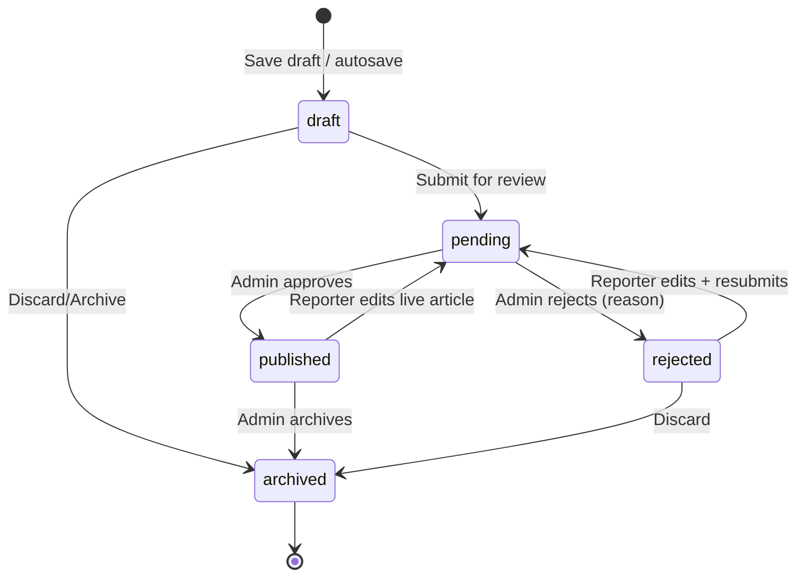
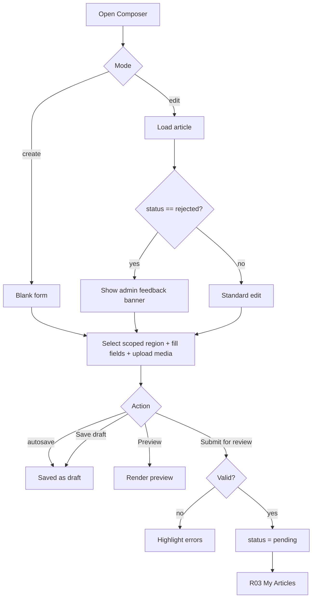

# R02 — Article Composer (Create/Edit)

## Metadata

| Field | Value |
|---|---|
| Page ID | R02 |
| Platforms | Mobile / Web |
| Roles | Reporter |
| Priority | P1 |
| Route / Path | Mobile: `ReporterTab → Composer`; Web: `/reporter/articles/new`, `/reporter/articles/:id/edit` |
| Prototype | `prototypes/web/r02-article-composer.html`, `prototypes/mobile/r02-article-composer.html` |

## Purpose

The Article Composer is where a Reporter creates and edits a news article. It
captures the **required Region** (a State → District → Constituency → Mandal
cascading selector limited to the reporter's assigned scopes per
`reporter_region_scopes` and REQ-REG-002), plus the title, slug, summary, body
(rich-text/markdown), categories, tags, and media — a **hero that may be an
image OR a video**, and a **mixed image/video gallery** with crop, reorder,
poster, and alt text. It supports a distraction-free preview, autosaves
continuously, and moves an article through the authoring lifecycle: save as
draft, or submit for review. In edit mode for a rejected article, the admin's
feedback is shown inline so the reporter can fix and resubmit. The composer
enforces content validation (title length, required region, required hero media
— image or video, minimum body length) before submission, and the selected
region determines which admins can review the article (REQ-REG-003). Video
uploads are resumable/chunked with per-file progress, and are transcoded
server-side (H.264/AAC MP4 + WebM) with a generated poster shown in the
composer while processing completes.

## UI Structure

### Mobile

Top to bottom inside the `s02` shell; composer hides the bottom tab bar and uses
a dedicated action header.

1. **Composer header** — `--white`, height `header-height-mobile` (62px), bottom
   border `--border`. Left: back/close icon (24px, `--text`) → unsaved-changes
   guard. Center: context label "New Article" / "Edit Article" (`weight-semibold`).
   Right: overflow menu (`⋮`) with Preview, Duplicate, Discard.
2. **Autosave/status strip** — thin bar under the header. Shows autosave state:
   "Saving…" (`--muted`, spinner), "Saved just now" (`--success`, check),
   "Offline — changes kept locally" (`--warning`). Tapping shows last-saved time.
3. **Rejection feedback banner (edit + rejected)** — pinned card, `--error` left
   accent, `--white` fill, `radius-md`, `shadow-sm`. Title "Changes requested by
   editor", the admin `rejectionReason` (full text), optional reviewer name/date,
   and a dismiss (×) that collapses to a chip. Non-dismissible until the article
   is resubmitted.
4. **Form body** — scrollable, content padding 16px, `space-4` between fields.
   - **Region** — **required** cascading selector: State → District →
     Constituency → Mandal. Only levels/branches within the reporter's assigned
     regions (`reporter_region_scopes`, including descendants) are selectable;
     out-of-scope nodes are hidden or shown disabled with a lock icon. Renders
     as four dependent selects on web and as four stacked bottom-sheet pickers
     on mobile; each level is disabled until its parent is chosen, and changing
     a parent resets the levels below it. A read-only **selected region path**
     (breadcrumb "Telangana › Hyderabad › Secunderabad › Bowenpally") displays
     under the control; the selector stops at the deepest assigned scope so a
     reporter scoped to a constituency cannot pick a mandal outside it. Required
     for both save-draft and submit (REQ-REG-001, REQ-REG-002).
   - **Title** — single-line text input, placeholder "Article title",
     `font-size-title-sm`, `weight-bold`; live character counter "42/120".
   - **Slug** — text input with `--muted` prefix `newswatch.com/`; auto-derived
     from title; "Edit" toggle to override manually; uniqueness indicator.
   - **Summary** — multiline (3 rows), `font-size-summary`, counter "110/300".
   - **Body** — markdown/rich-text editor, min-height 220px, toolbar sticky above
     keyboard: bold, italic, H2/H3, quote, bullet/numbered list, link, image
     insert. Toggle to Markdown source view. Word count + "min 200 words".
   - **Categories** — chip multi-select. Selected chips `--purple` fill /
     `--white` text; unselected `--purple-light` fill / `--purple` text with
     `--purple-tint-border`. "Add category" opens a searchable bottom sheet.
   - **Tags** — free-text tag input; tags render as removable `radius-pill`
     chips (`--background` fill, `--text`); dedupe + max 10.
   - **Hero media (image OR video)** — single upload dropzone (`--purple-light`
     fill, dashed `--purple-tint-border`, `radius-lg`) accepting one image
     (JPG/PNG/WebP ≤10MB) or one video (MP4/WebM/MOV ≤200MB, ≤3 min). After
     upload: image shows preview with "Crop", "Replace", "Remove" (crop opens a
     full-screen crop sheet with zoom/rotate and aspect presets — 16:9 default,
     4:3, 1:1); video shows an inline player preview with its **poster/thumbnail
     and a duration badge** (`0:00 / 3:00` style), "Replace", "Remove", and
     "Choose poster". When a video is transcoding, the slot shows
     "Processing video…" with a determinate progress bar, then "Ready".
     Exactly **one hero required** (image OR video).
   - **Gallery** — multi-media dropzone accepting **mixed images and videos**;
     up to 10 items; thumbnails in a 3-col grid with drag-to-reorder (mobile
     long-press, web drag handle), a duration badge on each video thumbnail, an
     upload progress overlay per large (video) file with retry/cancel,
     per-item "Alt text" field, "Remove", and an optional caption. Video items
     also offer "Choose poster".
5. **Sticky action bar** — bottom, `--white`, top border `--border`, safe-area
   padding. "Save draft" (secondary: `--white` fill, `--purple` border/text) and
   "Submit for review" (primary: `--purple`, hover `--purple-dark`). On a
   published article in edit mode, primary becomes "Save changes" and requires
   re-review (moves to Pending).

Component list: `ComposerHeader`, `AutosaveStrip`, `FeedbackBanner`,
`RegionSelector`, `RegionBreadcrumb`, `TextInput`, `SlugInput`, `SummaryInput`,
`RichTextEditor`, `CategoryChipGroup`, `TagInput`, `MediaDropzone`,
`CropperSheet`, `GalleryGrid`, `MediaThumbnail`, `VideoPreview`, `DurationBadge`,
`PosterPicker`, `ProcessingStatusChip`, `AltTextField`, `PrimaryButton`,
`SecondaryButton`, `ValidationMessage`, `UploadProgressBar`, `PreviewModal`.

### Web

- Dedicated composer layout: left/right form column max-width `content-max-width`
  (900px) centered; a persistent **right rail** shows a live "Editor preview"
  card (region path, hero media, title, summary) and a publish checklist
  (region ✓, title ✓, hero media (image/video) ✓, body ≥200 words ✓,
  category ✓).
- Header is a full-width toolbar (`header-height-web` = 68px): breadcrumb
  "Reporter / New Article", autosave text, "Preview" toggle, "Save draft",
  "Submit for review". Buttons right-aligned.
- Fields are two-column where sensible: Region (four cascading selects) full
  width with the path breadcrumb beneath; Title full width; Slug + Category
  share a row; Summary full width; Body full width; Tags full width; Hero media
  (60%) + Gallery (40%) row.
- Hover: dropzone border turns `--purple` and fill deepens to `--purple-light`
  at `dur-fast`; buttons darken; media thumbnails reveal overlay actions
  (including "Choose poster" on video) on hover. Focus-visible 2px `--purple`
  ring.
- Drag/drop is native: dropping image or video files onto the hero/gallery zone
  uploads them (large videos use chunked/resumable upload with a progress
  overlay); a drop overlay (scrim `--scrim`, white text "Drop to upload")
  appears.
- Video previews use native controls with the generated poster as the first
  frame and a duration badge; processing status ("Processing video…" → "Ready")
  is shown inline on the tile.

### Responsive behavior

- `xs` (0–390px): single column, body min-height 180px, gallery grid 2-col;
  action bar buttons stack full-width.
- `mobile` (0–768px): single column; sticky action bar with tabs hidden.
- `tablet` (769–1024px): single column form, right-rail preview collapses to a
  "Preview" button/modal.
- `desktop` (≥1025px): two-region layout with sticky right rail; two-column
  field rows as described.

## Features / Functional Requirements

| ID | Requirement | Priority |
|---|---|---|
| REQ-REP-020 | The composer MUST support both create and edit modes for an article. | P0 |
| REQ-REP-021 | The composer MUST capture title (required, 5–120 chars), summary (optional, ≤300 chars), and body (required, ≥200 words). | P0 |
| REQ-REP-022 | The composer MUST auto-generate a URL slug from the title and allow manual override with uniqueness validation. | P1 |
| REQ-REP-023 | The composer MUST provide a rich-text/markdown body editor with a source-view toggle. | P1 |
| REQ-REP-024 | The composer MUST allow multi-select of one or more categories from the active category list. | P0 |
| REQ-REP-025 | The composer MUST support free-text tags, deduped, up to 10 per article. | P2 |
| REQ-REP-026 | The composer MUST require exactly one hero media item (image OR video), uploaded with progress and error handling. | P0 |
| REQ-REP-027 | The composer MUST support a mixed gallery of up to 10 images/videos with reorder, crop (images), optional caption, and alt text. | P1 |
| REQ-REP-028 | The composer MUST provide a preview mode rendering the article as a reader would see it (mobile + web). | P1 |
| REQ-REP-029 | The composer MUST autosave drafts on a debounce (≈2s after last change) and on blur/background. | P0 |
| REQ-REP-030 | The composer MUST allow saving as a draft without passing submit-time validation (title+body baseline only). | P0 |
| REQ-REP-031 | "Submit for review" MUST enforce all required-field validation and move the article to `pending`. | P0 |
| REQ-REP-032 | In edit mode for a `rejected` article, the admin feedback banner MUST be shown and the article MUST remain editable. | P0 |
| REQ-REP-033 | The composer MUST warn before discarding unsaved changes and offer "Save draft" / "Discard". | P0 |
| REQ-REP-034 | Image uploads MUST show per-file progress and recoverable errors with "Retry". | P1 |
| REQ-REP-035 | The composer MUST retain body content and media locally when offline and sync on reconnect. | P2 |
| REQ-REP-036 | The composer MUST move a republished/edited live article back to `pending` on save. | P1 |
| REQ-REP-037 | Only the owning reporter MUST be able to edit an article; 403 otherwise. | P0 |
| REQ-REP-038 | The composer MUST enforce a max upload size (e.g. 10MB/image) and accepted types (JPEG/PNG/WebP). | P1 |
| REQ-REP-039 | The composer MUST provide inline character/word counters for title, summary, and body. | P2 |
| REQ-REP-080 | The composer MUST capture a required Region as a State → District → Constituency → Mandal cascading selector. | P0 |
| REQ-REP-081 | The Region selector MUST be limited to the reporter's assigned regions (including descendants) from `reporter_region_scopes`; out-of-scope regions MUST NOT be selectable (REQ-REG-002). | P0 |
| REQ-REP-082 | A Region MUST be required for both "Save draft" and "Submit for review", and the chosen region MUST be sent as `articles.region_id` (REQ-REG-001). | P0 |
| REQ-REP-083 | The composer MUST display the selected full region path as a breadcrumb. | P1 |
| REQ-REP-084 | The composer MUST validate the region server-side and reject an out-of-scope `region_id` (REQ-REG-004). | P0 |
| REQ-REP-085 | The body editor MUST be a rich-text editor supporting per-run formatting: bold, italic, underline, H2/H3, bullet/numbered lists, blockquote, link, text colour, and highlight colour. | P0 |
| REQ-REP-086 | A reporter MUST be able to set the **headline (title) text colour and font size** (presets + custom colour picker + size scale) with live preview. | P0 |
| REQ-REP-087 | A reporter MUST be able to set the **description (summary) text colour and font size** with live preview. | P0 |
| REQ-REP-088 | Styling choices MUST persist with the article as structured style metadata (`headlineStyle`, `descriptionStyle`) and render identically in feeds, article detail, and posters. | P0 |
| REQ-REP-089 | The composer MUST offer **5 share-poster templates** (Classic, Breaking, Minimal, Gradient, Photo Hero) with a live preview and allow selecting one per article. | P0 |
| REQ-REP-090 | The selected poster template (and any colour/size overrides) MUST be stored on the article as `poster` metadata. | P1 |
| REQ-REP-091 | When sharing, the app MUST generate a poster image from the chosen template and send it **together with** the headline, description, and article link. | P0 |
| REQ-REP-092 | The composer MUST link to the full **Share Poster editor (R05)** for finer control (background photo, size sliders, download/export). | P1 |
| REQ-REP-093 | The hero media MAY be an **image OR a video**; exactly one hero is required for submit (one of the two kinds, never both). | P0 |
| REQ-REP-094 | The gallery MUST support **mixed images and videos**, up to 10 items total. | P0 |
| REQ-REP-095 | Videos MUST be MP4/WebM/MOV, ≤200MB, and ≤3 minutes; images MUST be JPG/PNG/WebP and ≤10MB. | P0 |
| REQ-REP-096 | Video uploads MUST be transcoded server-side to H.264/AAC MP4 (+ WebM) and a poster/thumbnail MUST be generated (`media_assets.poster_url`). | P0 |
| REQ-REP-097 | Video uploads MUST use **resumable/chunked** transfer with per-file progress, retry, and cancel. | P0 |
| REQ-REP-098 | The reporter MUST be able to **reorder mixed media** and set a video **poster/thumbnail** frame. | P1 |
| REQ-REP-099 | Deleting or replacing media MUST update its processing status and detach it from the article. | P1 |

## User Interactions

- **Select region** — pick State → District → Constituency → Mandal in order;
  each level loads only the in-scope children of its parent; selecting a parent
  clears deeper levels; the breadcrumb updates live. If the reporter selects a
  branch they are not scoped to (e.g. via a stale cache), it is rejected inline.
- **Type title** — slug auto-syncs until the reporter manually edits the slug;
  counters update live; error clears on valid input.
- **Select category** — chip toggles to selected state (`dur-fast`), bottom-sheet
  search filters the list; multiple allowed.
- **Add tag** — Enter/comma commits a chip; backspace on empty removes last;
  duplicates flash an inline warning.
- **Upload hero (tap/drag)** — opens file picker or accepts drop for one image
  or one video; small images upload immediately with a determinate progress bar,
  while large videos upload in resumable chunks with progress, "Retry", and
  "Cancel"; on success an image/player preview appears with a scale-in
  (`dur-medium`, `ease-standard`). A video enters "Processing video…" until
  transcoding + poster generation completes, then shows "Ready".
- **Crop hero (image)** — opens `CropperSheet`; pinch-zoom / scroll-zoom, drag
  to pan, rotate button, aspect presets; "Apply" returns crop to the composer.
- **Preview video hero** — plays inline with native controls; the generated
  poster shows until play; a duration badge is overlaid.
- **Choose video poster** — scrub the preview and "Set as poster"; the chosen
  frame URL is stored as the media `posterMediaId`/poster.
- **Reorder gallery** — long-press (mobile) or drag handle (web); items lift
  (shadow-md, scale 1.03), others animate to fill space over `dur-medium`.
- **Cancel/retry video upload** — cancelling aborts remaining chunks and frees
  the tile; retry resumes from the last acknowledged chunk.
- **Toggle body mode** — switching between rich text and markdown preserves
  content; a confirm appears if conversion is lossy.
- **Preview** — opens full-screen/modal preview; web rail updates live per
  keystroke (debounced).
- **Save draft** — explicit save; autosave strip shows "Saved"; success toast.
- **Submit for review** — validates; on success shows confirmation ("Submitted
  for review") and navigates to R03/R01; on failure scrolls to first invalid
  field and highlights it.
- **Back/close with unsaved changes** — dialog "Save your changes?" with
  "Save draft", "Discard", "Cancel".
- **Animations** — autosave strip cross-fades between states (`dur-medium`);
  validation messages slide down (`dur-fast`); toasts use `z-toast`.

## Validation & Error States

| Field/Action | Rule | Error message |
|---|---|---|
| Region | Required (draft + submit); must be an assigned region or descendant | "Select a region for this article" |
| Region scope | Chosen `region_id` must be in `reporter_region_scopes` | "You can only publish to your assigned regions" |
| Region cascade | Each level required down to the intended scope | "Complete the region selection" |
| Title | Required; 5–120 chars | "Title must be between 5 and 120 characters" |
| Slug | Required; unique; lowercase-hyphen | "This URL is already taken" |
| Summary | Optional; ≤300 chars | "Summary must be 300 characters or fewer" |
| Body | Required for submit; ≥200 words | "Article body must be at least 200 words" |
| Categories | ≥1 required for submit | "Select at least one category" |
| Tags | ≤10; each ≤30 chars | "You can add up to 10 tags" |
| Hero media | Required for submit; exactly one image OR video | "A hero image or video is required" |
| Media type | Images JPEG/PNG/WebP; videos MP4/WebM/MOV | "Use JPG, PNG, WebP, MP4, WebM, or MOV files" |
| Image size | ≤10MB per image | "Images must be under 10MB" |
| Video size | ≤200MB per video | "Videos must be under 200MB" |
| Video duration | ≤3 minutes | "Videos must be 3 minutes or shorter" |
| Video codec | Container/codec must be decodable and transcodable | "This video format isn't supported" |
| Gallery | ≤10 items total (mixed image/video) | "You can add up to 10 media items" |
| Video processing | Transcode/poster job fails | "We couldn't process this video. Re-upload or retry." |
| Media alt text | Optional; ≤125 chars | "Alt text must be 125 characters or fewer" |
| Upload network | Upload fails | "Upload failed. Tap to retry" |
| Save draft | Server error | "Couldn't save your draft. We'll keep trying." |
| Edit ownership | Article not owned | "You don't have permission to edit this article" |
| Rejected resubmit | Feedback must be acknowledged (checkbox) | "Please confirm you've addressed the editor's feedback" |

## Loading, Empty, Success States

- **Loading (edit):** form skeleton matching field layout; fields disabled until
  `GET /reporter/articles/:id` resolves; autosave strip hidden.
- **Loading (upload):** determinate progress bar per image; thumbnail slot shows
  a blurred placeholder with percentage. Large videos show a chunked-upload
  progress bar with "Retry"/"Cancel" and a byte counter (e.g. "48 / 180 MB").
- **Processing (video):** tile/hero shows the generated poster with a
  "Processing video…" status chip and progress; on completion it switches to
  "Ready" and enables playback. Poster may be a blurred placeholder until the
  processing job emits the thumbnail.
- **Empty (new):** blank form with placeholder text; the Region selector starts
  at State and the preview rail shows a "Select a region and fill in the title
  to see a preview" hint; publish checklist all unchecked (region unchecked).
- **Empty (no regions):** if the reporter has no assigned scopes, the Region
  field shows a disabled state with "No regions assigned — contact an admin";
  Save draft and Submit are disabled.
- **Empty (gallery):** dropzone with "Add up to 10 images or videos" helper; no
  grid.
- **Success (media ready):** video tile/hero shows "Ready" with poster and
  duration badge; image shows preview with crop affordance.
- **Success (draft):** toast "Draft saved" + updated relative time in strip.
- **Success (submit):** full-width `--success` confirmation sheet with
  "Submitted for review" and CTA "Back to My Articles" (R03).
- **Error (fatal load):** error panel "Couldn't load this article" + "Retry".

## User Flow

1. Reporter enters from R01/R03 ("New Article" or edit action) or a rejection
   notification.
2. System loads the reporter's assigned regions
   (`GET /reporter/regions`), categories (`GET /categories`) and, in edit mode,
   the article (`GET /reporter/articles/:id`); if rejected, shows the feedback
   banner.
3. Reporter selects the Region (scoped cascade) and fills fields; hero media
   (image or video) and gallery items upload with progress — videos use
   chunked/resumable transfer then transcode server-side ("Processing video…" →
   "Ready"); autosave persists changes as a draft (debounced).
4. Reporter optionally previews the rendered article.
5. Reporter taps "Submit for review"; client validates, server re-validates, and
   the article transitions `draft/rejected → pending`.
6. Ends at R03 My Articles; admin review continues in A03.





## Dependencies

- **Screens:** R01 Reporter Dashboard, R03 My Articles, P09 Article Detail
  (preview parity), A03 Article Moderation (downstream review).
- **Components:** `RegionSelector`, `RegionBreadcrumb`, `RichTextEditor`,
  `MediaDropzone`, `CropperSheet`, `GalleryGrid`, `MediaThumbnail`,
  `VideoPreview`, `DurationBadge`, `PosterPicker`, `ProcessingStatusChip`,
  `CategoryChipGroup`, `TagInput`, `AutosaveStrip`, `FeedbackBanner`,
  `PreviewModal`, `ValidationMessage`, `Toast`.
- **Services/stores:** `composerStore` (form state, dirty flag, autosave queue,
  `regionId`, media list with `kind`/`processingStatus`), `regionsStore`
  (assigned scopes + cascade children), `mediaUploadService` (Cloudflare R2
  signed uploads, chunked/resumable video upload, progress, retry, cancel),
  `mediaProcessingPoller` (processing-status polling/webhook updates),
  `categoriesStore`, `apiClient`, `offlineQueue` (draft sync), `slugService`.
- **Backend endpoints:** `POST /api/v1/reporter/articles`,
  `PATCH /api/v1/reporter/articles/:id`,
  `GET /api/v1/reporter/articles/:id`, `POST /api/v1/media/sign`,
  `POST /api/v1/media/:id/complete`, `GET /api/v1/reporter/media/:id`,
  `GET /api/v1/reporter/regions`, `GET /api/v1/regions/:id/children`,
  `GET /api/v1/categories`, `POST /api/v1/reporter/articles/:id/submit`.

## API / Data Requirements

| Method | Endpoint | Purpose |
|---|---|---|
| POST | `/api/v1/reporter/articles` | Create a new article (draft or pending) |
| PATCH | `/api/v1/reporter/articles/:id` | Update article fields/media (autosave + explicit save) |
| GET | `/api/v1/reporter/articles/:id` | Load article for edit (incl. rejectionReason) |
| POST | `/api/v1/media/sign` | Get signed upload params (and chunk/resumable session for video) |
| POST | `/api/v1/media/:id/complete` | Confirm upload; for video enqueue transcode + poster generation |
| GET | `/api/v1/reporter/media/:id` | Poll media processing status, duration, dimensions, poster URL |
| GET | `/api/v1/reporter/regions` | Reporter's assigned region scopes (cascade roots) |
| GET | `/api/v1/regions/:id/children` | In-scope child regions for the next cascade level |
| GET | `/api/v1/categories` | Active category list for multi-select |
| POST | `/api/v1/reporter/articles/:id/submit` | Validate + move to `pending` |

Create/update payload:

```json
{
  "title": "Monsoon preparedness in coastal cities",
  "slug": "monsoon-preparedness-coastal-cities",
  "summary": "Cities ramp up drainage and evacuation planning ahead of the season.",
  "body": "## Overview\nHeavy rainfall...",
  "bodyFormat": "rich",
  "headlineStyle": { "color": "#8a007a", "fontSize": 34, "weight": 800 },
  "descriptionStyle": { "color": "#555555", "fontSize": 17 },
  "poster": { "template": "classic", "headlineColor": "#ffffff", "headlineSize": 30, "descColor": "#f3d9ef", "bgPhoto": null },
  "regionId": "c4a1...-9e",
  "categoryIds": ["8b2f...-a1"],
  "tags": ["monsoon", "infrastructure"],
  "heroMedia": {
    "mediaId": "m_123",
    "kind": "video",
    "alt": "Flooded street",
    "crop": { "x": 0, "y": 0.1, "w": 1, "h": 0.56 },
    "durationSec": 84,
    "posterMediaId": "m_123_poster",
    "processingStatus": "ready"
  },
  "media": [
    { "mediaId": "m_124", "kind": "image", "alt": "Drainage work", "caption": "Workers clear a drain", "processingStatus": "ready" },
    { "mediaId": "m_125", "kind": "video", "alt": "Interview", "durationSec": 156, "posterMediaId": "m_125_poster", "processingStatus": "processing" }
  ],
  "status": "draft"
}
```

> `heroMedia.kind` is `"image"` or `"video"`; exactly one hero is required
> (REQ-REP-093). `media` is the mixed gallery array (≤10, REQ-REP-094).
> `processingStatus` is one of `pending` | `processing` | `ready` | `failed`.

Response:

```json
{
  "success": true,
  "data": { "id": "7f1c2e9a-...-b3", "status": "pending", "updatedAt": "2026-09-22T10:15:00Z" },
  "meta": {},
  "error": null
}
```

Validation error:

```json
{ "success": false, "data": null, "error": { "code": "VALIDATION_ERROR", "message": "Article body must be at least 200 words", "fields": { "body": "min_words_200" } } }
```

Out-of-scope region error (REQ-REG-002/004):

```json
{ "success": false, "data": null, "error": { "code": "FORBIDDEN_REGION", "message": "You can only publish to your assigned regions", "fields": { "regionId": "out_of_scope" } } }
```

Media sign request/response:

Single-shot (image) sign:

```json
{ "success": true, "data": { "uploadUrl": "https://<account>.r2.cloudflarestorage.com/.../signed", "fields": { "key": "media/m_123", "policy": "..." }, "mediaId": "m_123" }, "meta": {}, "error": null }
```

Chunked/resumable (video) sign — returns a session id and chunk size; the client
PUTs each chunk and calls `/media/:id/complete` when all chunks are uploaded:

```json
{ "success": true, "data": { "mediaId": "m_125", "kind": "video", "uploadId": "up_9f2", "chunkSize": 5242880, "parts": [ { "partNumber": 1, "url": "https://<account>.r2.cloudflarestorage.com/.../part1" } ], "expiresAt": "2026-09-22T11:15:00Z" }, "meta": {}, "error": null }
```

Media status (poll `GET /api/v1/reporter/media/:id`):

```json
{ "success": true, "data": { "mediaId": "m_125", "kind": "video", "processingStatus": "processing", "durationSec": 156, "width": 1920, "height": 1080, "posterUrl": null, "playbackUrl": null }, "meta": {}, "error": null }
```

## Navigation

| Action | From | To |
|---|---|---|
| Tap back/close (clean) | R02 | R03 My Articles / R01 (origin) |
| Tap back/close (dirty) | R02 | Unsaved-changes dialog |
| Tap "Save draft" | R02 | R02 (stays, toast) |
| Tap "Submit for review" | R02 | R03 My Articles |
| Tap "Preview" | R02 | R02 Preview modal |
| Tap "Back to My Articles" (success) | R02 | R03 |
| Add category sheet | R02 | R02 Category sheet |
| Crop image | R02 | R02 Cropper sheet |

## Analytics Events

| Event | Trigger | Properties |
|---|---|---|
| `composer_opened` | Composer mount | `mode` (create/edit), `article_status` |
| `composer_region_selected` | Region cascade completes | `region_id`, `region_type` |
| `composer_region_rejected` | Out-of-scope region attempt | `region_id`, `mode` |
| `reporter_autosave` | Autosave success | `article_id`, `dirty_fields` |
| `article_draft_saved` | Explicit save | `article_id`, `word_count` |
| `article_submitted` | Submit success | `article_id`, `word_count`, `category_count`, `gallery_count` |
| `article_submit_failed` | Submit validation error | `article_id`, `error_code`, `field` |
| `hero_image_uploaded` | Hero image upload success | `size_kb`, `mime`, `duration_ms` |
| `hero_video_uploaded` | Hero video upload accepted | `size_kb`, `mime`, `duration_sec`, `duration_ms` |
| `image_upload_failed` | Upload error | `context` (hero/gallery), `reason` |
| `video_upload_started` | Chunked video upload begins | `context` (hero/gallery), `size_kb` |
| `video_upload_succeeded` | Video upload completed | `context`, `size_kb`, `duration_sec`, `chunks` |
| `video_upload_failed` | Video chunk/resumable error | `context`, `reason`, `retried` |
| `video_processing_completed` | Transcode/poster job → ready | `media_id`, `duration_sec`, `width`, `height`, `processing_ms` |
| `video_processing_failed` | Transcode/poster job failed | `media_id`, `reason` |
| `video_poster_set` | Reporter sets poster frame | `media_id`, `source` (scrub/auto) |
| `gallery_media_reordered` | Mixed gallery reorder | `context` (gallery), `from_index`, `to_index`, `kind` |
| `article_preview_opened` | Preview open | `article_id`, `platform` |
| `composer_discarded` | Discard confirmed | `article_id`, `mode` |

## Open Questions

- Rich text vs markdown as canonical storage: do we store both HTML and markdown,
  or one with server-side rendering?
- Should autosave create a new revision history, and do we expose revision
  restore in v1?
- Is crop metadata stored non-destructively (coordinates) or is a derived image
  generated at upload?
- Do we allow scheduling a publish time (out of scope for v1)?
- Exact body minimum: 200 words or a character-based threshold for non-English
  i18n-ready content?
- Should the composer default the Region to the reporter's most frequently used
  assigned scope, or always require an explicit choice?
- Can a reporter change an article's region after submission while it is
  `pending`, or only on a `draft`/`rejected` article?
