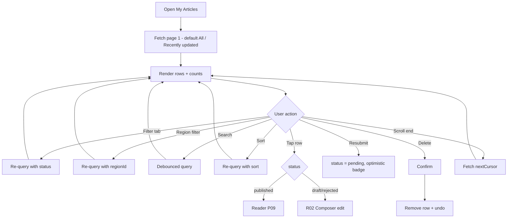
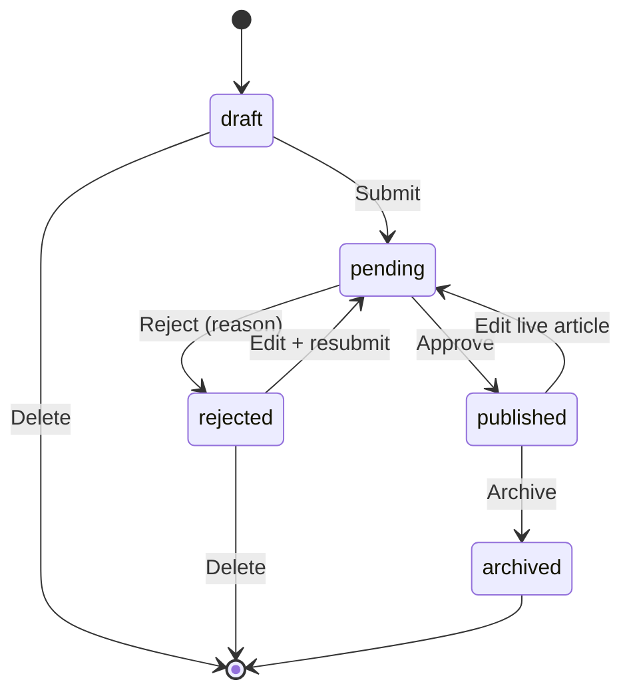

# R03 — My Articles (Status List)

## Metadata

| Field | Value |
|---|---|
| Page ID | R03 |
| Platforms | Mobile / Web |
| Roles | Reporter |
| Priority | P1 |
| Route / Path | Mobile: `ReporterTab → My Articles`; Web: `/reporter/articles` |
| Prototype | `prototypes/web/r03-my-articles.html`, `prototypes/mobile/r03-my-articles.html` |

## Purpose

My Articles is the reporter's workspace for managing every article they have
authored. It provides filtering by status (All / Draft / Pending / Published /
Rejected) **and by region** (the reporter's assigned scopes), text search,
sorting, colour-coded status badges, a Region column showing each article's
`region_id` path, and per-row actions (edit, view, delete, resubmit). Rejected
rows surface the admin's rejection reason inline (unchanged). The list is
paginated with cursor-based pagination, has a clear empty state, and is the
primary destination after saving or submitting from the composer.

## UI Structure

### Mobile

1. **Header** — `--white`, height 62px, bottom border `--border`. Title "My
   Articles" (`font-size-title-sm`, `weight-bold`). Right: search icon toggle and
   the "New Article" icon-button (`--purple`).
2. **Search bar** — appears on search-icon tap; `search-height` (40px),
   `--background` fill, `radius-md`, leading magnifier, clear (×) when non-empty,
   "Cancel" text button. Debounced (300ms) client/server query.
3. **Status filter tabs** — horizontal scrollable pill row pinned under the
   header. Items: All, Draft, Pending, Published, Rejected. Selected pill
   `--purple` fill / `--white` text; unselected `--white` fill / `--muted` text
   with `--border`. Each pill may show a count badge.
4. **Sort control** — row under tabs: "Sort: Recently updated ▾" opening a bottom
   sheet (Recently updated, Newest, Oldest, Most viewed, Most liked, Title A–Z).
   Result count shown right-aligned ("24 articles").
5. **Region filter** — a "Region: All ▾" control (horizontal chip row on wider
   phones, dropdown/bottom-sheet on `xs`) beside the sort control. Options are
   "All regions" plus the reporter's assigned regions (`GET /reporter/regions`);
   selecting one adds `regionId=` to the list query. Shows a count per region
   where available.
6. **Article rows** — `--white` cards, `radius-xl`, `shadow-sm`, `space-3`
   vertical gap, padding `space-4`:
   - Left thumbnail (56px, `radius-md`) or a `--background` placeholder icon.
   - Title (2-line clamp, `weight-semibold`, `--text`).
   - Meta line: status badge · **region chip** (most specific region name,
     `--muted` text, `radius-sm`; full path in the row tooltip/accessibility
     label) · category chips · relative updated time (`font-size-meta`,
     `--muted`).
   - **Rejected rows** additionally show a tinted reason strip inside the card
     (`--purple-light` background, `--error` left accent): "Reason: {rejectionReason}"
     and a small "Resubmit" CTA.
   - Trailing overflow (`⋮`) opens the row action sheet.
7. **Pagination** — infinite scroll; a `--muted` "Loading more…" footer spinner
   on fetch; "You're all caught up" when exhausted.
8. **Sticky "New Article" FAB** — mobile: circular FAB, `--purple`, `radius-pill`,
   `shadow-md`, above the tab bar.

Component list: `StatusTabs`, `SearchBar`, `SortSheet`, `RegionFilter`,
`ArticleRow`, `StatusBadge`, `RegionChip`, `RejectionReasonStrip`,
`RowActionsSheet`, `PaginationFooter`, `EmptyState`, `SkeletonRow`,
`ConfirmDialog`, `Fab`.

**Status badge colours** (token-based):

| Status | Fill | Text | Token |
|---|---|---|---|
| Draft | `--background` | `--muted-strong` | neutral |
| Pending | `--warning` @12% | `--warning` | warning |
| Published | `--success` @12% | `--success` | success |
| Rejected | `--error` @12% | `--error` | error |
| Archived | `--border` | `--muted` | neutral |

Badges use `radius-sm`, `font-size-meta`, `weight-semibold`, 6px/10px padding,
optional leading status dot.

### Web

- Content container max-width `content-max-width` (900px), `space-9` vertical
  padding, `--background`.
- Header row: title left, search box (`search-width` 230px) + region dropdown +
  sort dropdown + "New Article" primary button right.
- Status filter rendered as a **left vertical sidebar** (All / Drafts / Pending /
  Published / Rejected with counts) on desktop; the list occupies the right
  region. Rows are denser: thumbnail 64px, action buttons visible on hover
  (Edit, View, Delete, Resubmit) instead of an overflow sheet.
- Region shown as a chip in each row's meta line; the region dropdown filters
  the list to an assigned region.
- Rejected reason shown as an expandable inline panel with "Edit & resubmit"
  (unchanged).
- Hover: row fills `--purple-light`; action icons fade in (`dur-fast`); sort and
  filter controls use `--purple-dark` on hover. Focus-visible 2px `--purple` ring.
- Optional table toggle (List/Table) with columns: Title, Status, **Region**,
  Categories, Views, Likes, Updated, Actions (P2).

### Responsive behavior

- `xs` (0–390px): tabs scroll with edge fade; row meta wraps to two lines; FAB
  slightly smaller.
- `mobile` (0–768px): mobile layout; filter tabs, no sidebar.
- `tablet` (769–1024px): sidebar collapses to the horizontal tabs; two-column
  card grid (optional) for rows.
- `desktop` (≥1025px): vertical filter sidebar + single-column list, hover actions.

## Features / Functional Requirements

| ID | Requirement | Priority |
|---|---|---|
| REQ-REP-040 | The list MUST show only articles owned by the signed-in reporter. | P0 |
| REQ-REP-041 | The list MUST support status filters: All, Draft, Pending, Published, Rejected (and Archived when present). | P0 |
| REQ-REP-042 | The list MUST support text search over title/summary/tags, debounced 300ms. | P1 |
| REQ-REP-043 | The list MUST support sorting by Recently updated, Newest, Oldest, Most viewed, Most liked, and Title A–Z. | P1 |
| REQ-REP-044 | Each row MUST display a token-coloured status badge per the status colour map. | P0 |
| REQ-REP-045 | Rejected rows MUST display the admin rejection reason inline with a resubmit CTA. | P0 |
| REQ-REP-046 | Each row MUST offer Edit, View, Delete, and (for rejected/published) Resubmit actions, subject to status rules. | P1 |
| REQ-REP-047 | The list MUST paginate with cursor-based pagination and infinite scroll/virtualised rendering. | P1 |
| REQ-REP-048 | The list MUST show a count of matching articles and a distinct message per empty filter. | P2 |
| REQ-REP-049 | Deleting MUST require confirmation and MUST be limited to remote non-published articles. | P0 |
| REQ-REP-050 | Tapping a row MUST open the correct destination by status (published → reader; else → composer). | P1 |
| REQ-REP-051 | The list MUST reflect status changes made elsewhere within one refresh (optimistic update on resubmit/delete). | P1 |
| REQ-REP-052 | The list MUST persist the last selected filter/sort/search within the session. | P2 |
| REQ-REP-053 | The list MUST render skeleton rows during initial load and on filter change. | P1 |
| REQ-REP-054 | The list MUST provide a "New Article" entry point from the header/FAB. | P1 |
| REQ-REP-055 | Filter tabs/sidebar MUST show per-status counts for the reporter. | P2 |
| REQ-REP-056 | The list MUST display each article's Region (from `articles.region_id`) on every row. | P1 |
| REQ-REP-057 | The list MUST support filtering by region, limited to the reporter's assigned regions (`reporter_region_scopes`, REQ-REG-002). | P1 |
| REQ-REP-058 | The region filter MUST combine with status, search, and sort without dropping params. | P1 |
| REQ-REP-059 | Out-of-scope or stale region filter values MUST fall back to "All regions" rather than erroring. | P2 |

## User Interactions

- **Tap filter tab/pill** — switches filter; list re-queries with `status`; active
  pill animates background/color over `dur-fast`; skeleton rows shown during
  fetch; scroll resets to top.
- **Change region filter** — opens the region sheet/dropdown; selecting an
  assigned region re-queries with `regionId` (composed with status/search/sort);
  "All regions" clears it; selection animates `dur-fast`.
- **Search** — focus auto-opens keyboard; typing debounces; clearing restores the
  unfiltered list; no-results state appears inline.
- **Sort** — opens sheet/dropdown; selection re-queries with `sort`; checkmark on
  active option; sheet closes with `dur-medium` slide.
- **Tap row** — navigate per status (see Navigation).
- **Overflow `⋮` (mobile) / hover actions (web)** — action sheet/menu with Edit,
  View, Delete, Resubmit; items disabled by status (e.g., View disabled for
  drafts; Resubmit only for rejected/published).
- **Resubmit** — calls submit endpoint; row badge optimistically flips to Pending
  with a brief highlight pulse (`dur-medium`); toast "Submitted for review".
- **Delete** — confirm dialog ("Delete this article? This can't be undone.");
  on confirm row collapses (height + fade), list compacts; undo toast for 5s.
- **Pull-to-refresh (mobile)** — re-fetches page 1; `--purple` spinner.
- **Infinite scroll** — near bottom fetches `nextCursor`; footer loader inline.
- **Long-press (mobile)** — opens the same action sheet.
- **Animations** — tabs underline/pill slide `dur-fast`; list item add/remove
  uses layout animation `dur-medium` `ease-standard`; skeleton shimmer loop.

## Validation & Error States

| Field/Action | Rule | Error message |
|---|---|---|
| Search query | ≤120 chars | "Search is too long" |
| Delete | Only own non-published | "Published articles can't be deleted" |
| Resubmit | Only `rejected` or `published` | "This article can't be resubmitted" |
| Edit | Only `draft`/`rejected`/`published` | "This article is under review and can't be edited" |
| List fetch | Network/server fail | "Couldn't load your articles. Retry" |
| Pagination fetch | Next page fail | Inline footer "Couldn't load more. Retry" |
| Unknown status param | Invalid filter | Falls back to All (no error surfaced) |
| Region filter | Must be one of the reporter's assigned regions | Falls back to "All regions" (no error surfaced) |
| Region display | Article `region_id` missing/unresolvable | Shows "Region unavailable" muted chip |

## Loading, Empty, Success States

- **Loading (initial):** 4–5 skeleton rows (thumbnail block + two text lines +
  badge pill) with shimmer; filter counts show as `–`.
- **Loading (filter/search change):** skeletons replace rows; previous results
  may stay dimmed (opacity 0.6) behind a top progress bar.
- **Empty (no articles at all):** illustration + "You haven't written any
  articles yet" + primary CTA "New Article".
- **Empty (filter has no matches):** status-specific copy, e.g. "No draft
  articles" / "No rejected articles — nice work!" + "Clear filter" action.
- **Empty (search no matches):** "No articles match '{query}'" + "Clear search".
- **Empty (region filter no matches):** "No articles in {region}" + "Clear
  region filter".
- **Success:** populated list with counts; after resubmit the row shows Pending;
  after delete the row is gone with an undo option.

## User Flow

1. Reporter opens My Articles from R01 ("See all"/stat card) or the Reporter tab.
2. System calls `GET /api/v1/reporter/articles` with default filter/sort and
   renders rows (skeletons first).
3. Reporter filters (by status and/or assigned region), searches, and/or sorts;
   system re-queries with the composed params and resets the cursor.
4. Reporter taps a row → opens R02 (edit) or the reader (published).
5. Reporter taps Resubmit on a rejected row → article moves to `pending`.
6. Reporter deletes a draft/scrapped article with confirmation (undo available).
7. Ends at R02, R01, or the article reader.





## Dependencies

- **Screens:** R01 Reporter Dashboard, R02 Article Composer, P09 Article Detail,
  A03 Article Moderation.
- **Components:** `StatusTabs`, `StatusBadge`, `RegionChip`, `RegionFilter`,
  `ArticleRow`, `SearchBar`, `SortSheet`, `RowActionsSheet`, `ConfirmDialog`,
  `PaginationFooter`, `EmptyState`, `SkeletonRow`, `Toast`, `Fab`.
- **Services/stores:** `reporterStore` (article pages, filters, counts,
  `regionId`), `regionsStore` (assigned scopes for the filter), `apiClient`,
  `searchDebounce`, `paginationCache`, `optimisticUpdate`.
- **Backend endpoints:** `GET /api/v1/reporter/articles`,
  `GET /api/v1/reporter/articles/:id`, `GET /api/v1/reporter/regions`,
  `DELETE /api/v1/reporter/articles/:id`,
  `POST /api/v1/reporter/articles/:id/submit`.

## API / Data Requirements

| Method | Endpoint | Purpose |
|---|---|---|
| GET | `/api/v1/reporter/articles?status=&regionId=&q=&sort=&cursor=&limit=` | Paginated, filtered, sorted list (region-scoped) |
| GET | `/api/v1/reporter/counts` | Per-status counts for tabs/sidebar |
| GET | `/api/v1/reporter/regions` | Assigned regions for the region filter |
| DELETE | `/api/v1/reporter/articles/:id` | Delete a draft/rejected article |
| POST | `/api/v1/reporter/articles/:id/submit` | Resubmit a rejected/published article |

List response:

```json
{
  "success": true,
  "data": [
    {
      "id": "7f1c2e9a-...-b3",
      "title": "Monsoon preparedness in coastal cities",
      "summary": "Cities ramp up drainage and evacuation planning.",
      "status": "rejected",
      "rejectionReason": "Missing hero image credit and unsourced claims.",
      "heroImageUrl": "https://cdn.example.com/...",
      "regionId": "c4a1...-9e",
      "regionPath": "Telangana › Hyderabad › Secunderabad › Bowenpally",
      "categories": [{ "id": "8b2f...", "name": "India" }],
      "views": 120,
      "likes": 8,
      "updatedAt": "2026-09-22T10:15:00Z"
    }
  ],
  "meta": { "nextCursor": "eyJpZCI6...", "hasMore": true, "total": 24 },
  "error": null
}
```

Counts response:

```json
{ "success": true, "data": { "all": 24, "draft": 5, "pending": 3, "published": 15, "rejected": 1 }, "meta": {}, "error": null }
```

Success (delete):

```json
{ "success": true, "data": { "id": "7f1c2e9a-...-b3", "deleted": true }, "meta": {}, "error": null }
```

## Navigation

| Action | From | To |
|---|---|---|
| Tap row (published) | R03 | P09 Article Detail |
| Tap row (draft/rejected) | R03 | R02 Article Composer (edit) |
| Tap Edit | R03 | R02 Article Composer (edit) |
| Tap View | R03 | P09 Article Detail (preview for unpublished) |
| Tap Resubmit | R03 | R03 (optimistic Pending) |
| Tap Delete | R03 | Confirm dialog |
| Tap "New Article" (header/FAB) | R03 | R02 Article Composer (create) |
| Tap back | R03 | R01 Reporter Dashboard |

## Analytics Events

| Event | Trigger | Properties |
|---|---|---|
| `my_articles_viewed` | Screen mount | `default_filter`, `platform` |
| `my_articles_filter_changed` | Filter tap | `status`, `result_count` |
| `my_articles_region_filtered` | Region filter change | `region_id` (or `all`), `result_count` |
| `my_articles_searched` | Debounced search | `query_length`, `result_count` |
| `my_articles_sorted` | Sort change | `sort_key` |
| `article_row_opened` | Row tap | `article_id`, `status`, `target` |
| `article_resubmitted` | Resubmit success | `article_id` |
| `article_deleted` | Delete confirmed | `article_id`, `status` |
| `my_articles_empty_state_viewed` | Empty render | `reason` (no_articles/filter/search) |

## Open Questions

- Do we need multi-select bulk actions (bulk delete/archive) in v1?
- Should the resubmit of a published article be allowed directly, or must it be
  unpublished first?
- Is there a "withdraw submission" action for Pending → Draft?
- Do we show archived articles in a separate tab or only in "All"?
- Undo window duration for delete (5s proposed) and backend soft-delete
  semantics.
- Should the region filter offer a hierarchical (parent/child) selector or a
  flat list of assigned scopes?
- Should region counts appear next to the region filter options?
