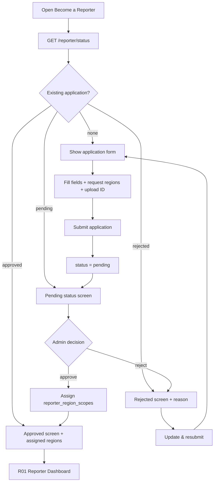
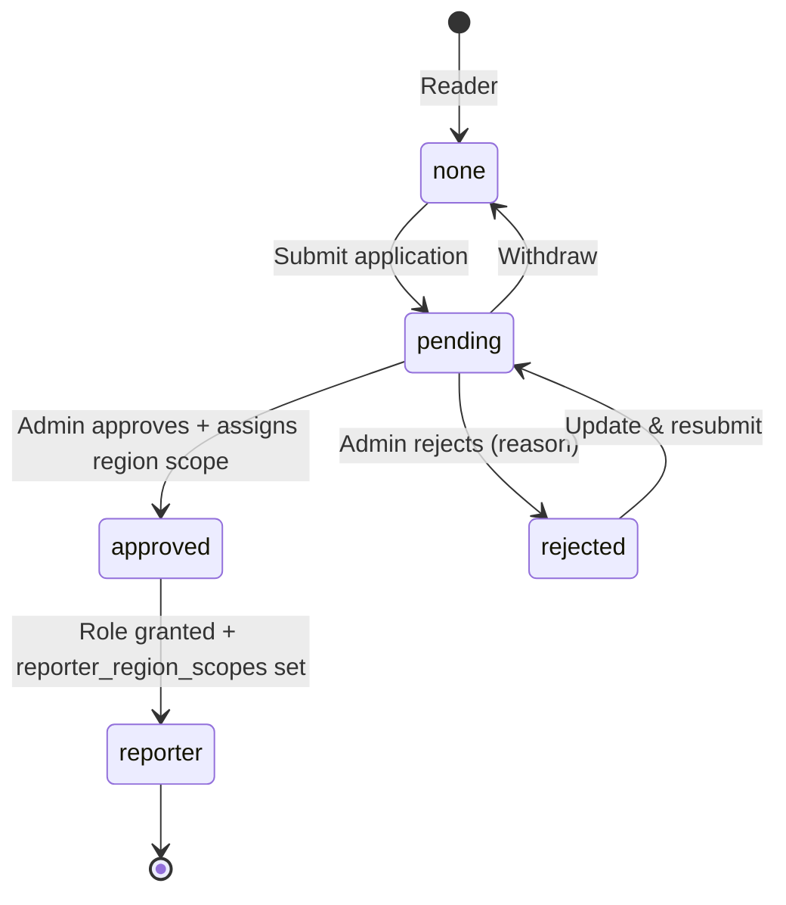

# R04 — Reporter Application

## Metadata

| Field | Value |
|---|---|
| Page ID | R04 |
| Platforms | Mobile / Web |
| Roles | User (applicant) / Reporter (post-approval) |
| Priority | P2 |
| Route / Path | Mobile: `Profile → Become a Reporter`; Web: `/reporter/apply` |
| Prototype | `prototypes/web/r04-reporter-application.html`, `prototypes/mobile/r04-reporter-application.html` |

## Purpose

The Reporter Application page lets a signed-in Reader apply for the Reporter
role. It collects the applicant's full name, bio, areas of expertise/categories,
**preferred/requested regions** (a State → District → Constituency → Mandal
cascading selector), optional sample article links, identity/verification
information, and phone number, then submits the application for admin review.
After submission the page becomes a read-only status screen (pending), and it
receives approval or rejection outcomes as notifications. If rejected, the
applicant can read the admin's reason, revise their details, and resubmit.
Approval grants the Reporter role, assigns the reporter's region scope
(`reporter_region_scopes`, set by the admin during approval at A06 or by a
super admin) and unlocks R01–R03. Once approved, the status screen displays the
**assigned region scope** the admin granted.

## UI Structure

### Mobile

1. **Header** — `--white`, height 62px, bottom border `--border`. Back icon →
   Profile; title "Become a Reporter" (`font-size-title-sm`, `weight-bold`).
2. **Intro block** — content padding 16px. Lead paragraph "Apply to write for
   NewsWatch" (`font-size-title-sm`, `weight-extrabold`), supporting copy
   (`--muted-strong`), and a 3-item benefit list (verified badge, byline, reach)
   with check icons (`--success`).
3. **Progress/stepper** — "Step 1 of 1" or a 2-step indicator (Details →
   Verification). Filled segment `--purple`, remaining `--border`.
4. **Form** — single scrollable column, `space-4` between fields.
   - **Full name** — required, 2–80 chars.
   - **Phone number** — required, E.164 with country selector; OTP-verifiable.
   - **Bio** — multiline, 40–600 chars, counter.
   - **Expertise / categories** — chip multi-select of reporting beats
     (Politics, Sports, Business, Technology, ...). Min 1, max 5. Selected
     `--purple`; helper "Pick the topics you'll cover".
   - **Preferred / requested regions** — cascading selector State → District →
     Constituency → Mandal (same `RegionSelector` pattern as R02) letting the
     applicant request where they want to report. The full approved region tree
     is browsable here (no scope restriction — the applicant chooses); at least
     one region is required; multiple regions may be requested ("Add another
     region"). Each requested region renders as a removable path chip
     (`--purple-light`/`--purple`). Helper: "Request the areas you want to
     cover — an admin confirms your final scope." These are advisory and are
     confirmed as the actual `reporter_region_scopes` during admin approval.
   - **Sample article links** — repeatable URL rows ("Add another"; up to 5),
     each a URL input with remove (×). Optional; validated as URLs.
   - **Identity / verification info** — government ID type select + ID number
     input + ID document upload (front; optional back). Dropzone styled like R02
     hero (`--purple-light`, dashed `--purple-tint-border`, `radius-lg`) with
     preview and "Replace". Sensitive fields masked by default with a reveal
     toggle (`◯`/eye icon). A privacy consent checkbox links to the policy.
5. **Sticky action bar** — "Submit application" (primary `--purple`), disabled
   until required fields are valid; safe-area padding.

Component list: `ApplicationHeader`, `Stepper`, `TextInput`, `PhoneInput`,
`TextArea`, `CategoryChipGroup`, `RegionSelector`, `RegionChip`,
`RepeatableUrlList`, `SelectInput`, `DocumentDropzone`, `ConsentCheckbox`,
`PrimaryButton`, `StatusScreen`, `RejectionNotice`, `Toast`.

**Status screen (same page, replaces form after submit):**

- Pending: centered illustration + "Application under review" (`font-size-title`,
  `weight-extrabold`) + copy "We'll notify you within 2–3 business days." +
  `--warning` pill badge + "View submitted details" disclosure (including the
  requested regions) + secondary CTA "Back to Home".
- Rejected: `--error` left-accent notice card with the admin `rejectionReason`,
  "What to do next" helper, and primary CTA "Update & resubmit" which re-opens
  the form pre-filled. Secondary "Contact support".
- **Approved: shows the applicant's assigned region scope** — a "Your reporting
  regions" section listing each assigned path as a `RegionChip`
  (State → District → Constituency → Mandal) from `reporter_region_scopes`,
  with `--success` badge and CTA "Go to Reporter Dashboard" (R01). If no scope
  was assigned, shows a `--warning` note "No regions assigned yet" and directs
  the user to contact an admin (they cannot author until a scope exists).

### Web

- Two-region layout: centered content max-width `content-max-width` (900px).
  Left form column (~62%), right sticky "Why write with us" info card with
  benefits, review timeline, and content guidelines link.
- Stepper rendered horizontally across the top with labelled steps.
- Fields two-per-row where appropriate: Full name + Phone; ID type + ID number;
  Preferred regions (cascading selects) full width; Bio and Sample links full
  width.
- ID document upload uses a bordered dropzone with native drag/drop and a preview
  thumbnail; sensitive fields masked until the eye toggle.
- Hover: buttons darken to `--purple-dark` (`dur-fast`); dropzone border →
  `--purple`; links underline. Focus-visible 2px `--purple` ring. Disabled submit
  = 0.5 opacity, `not-allowed` cursor.
- Pending/rejected status renders as a centered card in the same container (max
  560px) rather than the two-column form.

### Responsive behavior

- `xs` (0–390px): stepper labels hidden (dots only); benefit list stacks; sticky
  submit full-width.
- `mobile` (0–768px): single column; right info card collapses into an
  accordion "Why write with us" above the form.
- `tablet` (769–1024px): single form column with info card stacked below.
- `desktop` (≥1025px): two-region layout with sticky info rail.

## Features / Functional Requirements

| ID | Requirement | Priority |
|---|---|---|
| REQ-REP-060 | The page MUST be reachable only by authenticated users without an existing Reporter or Admin role. | P0 |
| REQ-REP-061 | The form MUST capture full name, phone, bio, expertise/categories, preferred/requested regions, optional sample links, and identity verification info. | P1 |
| REQ-REP-062 | The form MUST require full name, phone, bio, at least one category, **at least one preferred region**, and a government ID number for submission. | P1 |
| REQ-REP-063 | The phone number MUST be verifiable via OTP before submission (or reuse the verified account phone). | P2 |
| REQ-REP-064 | Sample article links MUST be optional, up to 5, each a valid URL. | P2 |
| REQ-REP-065 | Identity documents MUST upload over HTTPS to restricted storage and be visible only to the applicant and admins. | P1 |
| REQ-REP-066 | The page MUST NOT allow more than one active application per user; it shows status instead. | P0 |
| REQ-REP-067 | On submission the page MUST switch to a read-only pending status screen. | P0 |
| REQ-REP-068 | The status screen MUST display the review outcome and, when rejected, the admin rejection reason. | P1 |
| REQ-REP-069 | A rejected applicant MUST be able to update and resubmit their application with fields pre-filled. | P1 |
| REQ-REP-070 | Approval MUST grant the Reporter role, unlock R01–R03, and notify the user. | P0 |
| REQ-REP-071 | The applicant MUST be able to withdraw a pending application before a decision. | P2 |
| REQ-REP-072 | The form MUST autosave entered values locally so a dropped session doesn't lose the draft application. | P2 |
| REQ-REP-073 | A consent checkbox MUST be required before submitting personal/ID data. | P0 |
| REQ-REP-074 | The page MUST show a clear explanation of the review process and expected timeline. | P2 |
| REQ-REP-075 | The form MUST let the applicant request one or more regions via a State → District → Constituency → Mandal cascading selector. | P1 |
| REQ-REP-076 | At least one requested region MUST be required for submission. | P1 |
| REQ-REP-077 | Requested regions MUST be advisory; the actual scope is assigned as `reporter_region_scopes` by an admin at approval (A06) or a super admin (REQ-REG-001..007). | P1 |
| REQ-REP-078 | The approved status screen MUST display the assigned region scope from `reporter_region_scopes`. | P1 |
| REQ-REP-079 | If approval grants no region scope, the status screen MUST warn that authoring is disabled until an admin assigns regions. | P1 |

## User Interactions

- **Select categories** — chips toggle (`dur-fast`); min-1 / max-5 enforced with
  a subtle shake + inline note when exceeding the max.
- **Request regions** — pick State → District → Constituency → Mandal; each
  level loads its children; "Add another region" appends a new cascade, rendering
  each requested region as a removable path chip; removing a chip clears it.
- **Add sample link** — "Add another" appends an empty URL row with a slide-down
  animation (`dur-medium`); remove collapses the row.
- **Upload ID document** — tap or drag; determinate progress bar; on success a
  thumbnail preview with "Replace"/"Remove".
- **Reveal sensitive field** — eye toggle switches input between masked (`••••`)
  and visible; auto-re-masks on blur.
- **Submit** — validates all fields; button shows an inline spinner and disables;
  on success the form slides out and the pending status screen fades/slides in
  (`dur-slow`, `ease-standard`).
- **Pending status** — no editable fields; "View submitted details" expands a
  read-only summary; "Withdraw application" (if enabled) opens a confirm dialog.
- **Rejected status** — "Update & resubmit" re-opens the pre-filled form
  (including previously requested regions) and scrolls to the first field
  referenced by the rejection reason (when provided).
- **Approved status** — assigned regions render as chips; tapping a chip opens
  R03 filtered to that region.
- **Push notification** — tapping an approval/rejection push deep-links to this
  page in its resolved status state.
- **Animations** — stepper fill animates `dur-medium`; status screen cross-fades
  from the form; toasts at `z-toast`.

## Validation & Error States

| Field/Action | Rule | Error message |
|---|---|---|
| Full name | Required; 2–80 chars | "Enter your full name" |
| Phone | Required; valid E.164; verified | "Enter a valid phone number" |
| Bio | Required; 40–600 chars | "Bio must be between 40 and 600 characters" |
| Expertise | Required; 1–5 categories | "Select at least one topic (up to 5)" |
| Preferred regions | Required; ≥1 region; each level chosen | "Select at least one region you'd like to cover" |
| Region cascade | Parent required before child | "Complete the region selection" |
| Sample link | Optional; valid URL; ≤5 | "Enter a valid URL (https://…)" |
| ID type | Required on submit | "Select an ID type" |
| ID number | Required; format by type | "Enter a valid ID number" |
| ID document | Required; JPEG/PNG/PDF; ≤10MB | "Upload a JPEG, PNG, or PDF under 10MB" |
| Consent | Must be checked | "Please accept the privacy terms to continue" |
| Submit | Duplicate active application | "You already have an application under review" |
| Submit | Server error | "Couldn't submit your application. Please retry" |
| Upload | Network/format fail | "Upload failed. Tap to retry" |

## Loading, Empty, Success States

- **Loading (arrive):** header + skeleton form fields; if a previous application
  exists, the status endpoint is checked first so the correct view renders
  without a flash of the form.
- **Loading (submit):** submit button shows a spinner, fields disabled, full-page
  non-blocking progress; prevents double submission.
- **Empty (new applicant):** blank form with placeholders and helper text; submit
  disabled until minimum valid.
- **Success (submitted):** pending status screen with `--warning` badge, expected
  timeline, and "Back to Home".
- **Success (approved):** status screen switches to an approved state with
  `--success` badge, displays the assigned region scope chips, and CTA "Go to
  Reporter Dashboard" (R01). If no regions were assigned, shows a `--warning`
  "No regions assigned yet" note instead.
- **Rejected:** status screen shows the `--error` notice with reason and
  "Update & resubmit".
- **Error (load):** "Couldn't load your application" + "Retry".

## User Flow

1. Reader signs in and opens "Become a Reporter" from Profile (or a dashboard
   empty-state prompt).
2. System checks `GET /api/v1/reporter/status`: if none, present the form; if
   pending/rejected/approved, present the corresponding status screen.
3. Applicant completes the form (name, phone, bio, categories, preferred
   regions, optional links, ID info + document) and accepts the privacy consent.
4. Applicant taps "Submit application"; client and server validate; the
   application is created with status `pending`.
5. Admin reviews the application in A06 Reporter Approvals and **assigns the
   reporter's region scope** (`reporter_region_scopes`), which may differ from
   the requested regions.
6. Applicant is notified: approval unlocks the Reporter role (R01) and shows the
   assigned region scope on the status screen; rejection includes a reason and
   enables resubmission (back to step 3).
7. Ends at R01 Reporter Dashboard (approved), P07 Home (pending/withdrawn), or
   the pre-filled form (rejected → resubmit).





## Dependencies

- **Screens:** P18 Profile (entry), R01 Reporter Dashboard, A06 Reporter
  Approvals (admin), P03/P05 auth for phone OTP.
- **Components:** `Stepper`, `PhoneInput`, `CategoryChipGroup`,
  `RegionSelector`, `RegionChip`, `RepeatableUrlList`, `DocumentDropzone`,
  `ConsentCheckbox`, `StatusScreen`, `RejectionNotice`, `Toast`,
  `ConfirmDialog`.
- **Services/stores:** `authStore` (role, phoneVerified), `applicationStore`
  (draft, status, reason, requestedRegions), `regionsStore` (region tree for the
  cascade), `mediaUploadService` (secure document upload), `otpService`,
  `apiClient`, `localDraftCache`.
- **Backend endpoints:** `GET /api/v1/reporter/status`,
  `POST /api/v1/reporter/apply`, `PATCH /api/v1/reporter/apply`
  (update/resubmit), `POST /api/v1/reporter/apply/withdraw`,
  `GET /api/v1/regions` (region tree), `GET /api/v1/regions/:id/children`,
  `POST /api/v1/media/sign`, `POST /api/v1/auth/otp/send`,
  `POST /api/v1/auth/otp/verify`.

## API / Data Requirements

| Method | Endpoint | Purpose |
|---|---|---|
| GET | `/api/v1/reporter/status` | Current application status + reason + submitted details + assigned regions (when approved) |
| POST | `/api/v1/reporter/apply` | Submit a new reporter application (incl. requested region IDs) |
| PATCH | `/api/v1/reporter/apply` | Update and resubmit a rejected application |
| POST | `/api/v1/reporter/apply/withdraw` | Withdraw a pending application |
| GET | `/api/v1/regions` | Region tree for the preferred-region cascade |
| GET | `/api/v1/regions/:id/children` | Child regions for the next cascade level |
| POST | `/api/v1/media/sign` | Signed upload for the ID document |
| POST | `/api/v1/auth/otp/send` | Send OTP to verify phone (if not verified) |
| POST | `/api/v1/auth/otp/verify` | Verify phone OTP |

Application payload:

```json
{
  "fullName": "Rahul Verma",
  "phone": "+919876543210",
  "phoneVerified": true,
  "bio": "Freelance journalist covering technology and startups for 6 years.",
  "categories": ["technology", "business"],
  "requestedRegionIds": ["c4a1...-9e", "aa02...-71"],
  "sampleLinks": ["https://example.com/portfolio/article-1"],
  "id": {
    "type": "national_id",
    "number": "XXXX-XXXX-1234",
    "documentMediaId": "m_555"
  },
  "consent": true
}
```

Status response:

```json
{
  "success": true,
  "data": {
    "status": "rejected",
    "rejectionReason": "Sample links are broken and bio needs more detail.",
    "submittedAt": "2026-09-18T09:00:00Z",
    "reviewedAt": "2026-09-21T14:30:00Z",
    "application": {
      "fullName": "Rahul Verma",
      "categories": ["technology", "business"],
      "requestedRegions": [
        { "regionId": "c4a1...-9e", "path": "Telangana › Hyderabad › Secunderabad › Bowenpally" }
      ],
      "sampleLinks": ["https://example.com/portfolio/article-1"]
    }
  },
  "meta": {},
  "error": null
}
```

Approved status response (assigned scope from `reporter_region_scopes`):

```json
{
  "success": true,
  "data": {
    "status": "approved",
    "reviewedAt": "2026-09-21T14:30:00Z",
    "assignedRegions": [
      {
        "regionId": "c4a1...-9e",
        "type": "constituency",
        "path": "Telangana › Hyderabad › Secunderabad"
      }
    ]
  },
  "meta": {},
  "error": null
}
```

Submit success:

```json
{ "success": true, "data": { "status": "pending", "submittedAt": "2026-09-22T10:15:00Z" }, "meta": {}, "error": null }
```

Duplicate error:

```json
{ "success": false, "data": null, "error": { "code": "CONFLICT", "message": "You already have an application under review", "fields": {} } }
```

## Navigation

| Action | From | To |
|---|---|---|
| Tap back | R04 | P18 Profile (or origin) |
| Submit success | R04 | R04 (pending status screen) |
| Tap "Back to Home" | R04 | P07 Home / News Feed |
| Rejected → "Update & resubmit" | R04 | R04 (pre-filled form) |
| Approved → tap a region chip | R04 | R03 My Articles (region filtered) |
| Approved → "Go to Reporter Dashboard" | R04 | R01 Reporter Dashboard |
| Tap content guidelines link | R04 | P21 About / Static Pages |
| Approval/rejection push tap | (Push) | R04 (resolved status) |

## Analytics Events

| Event | Trigger | Properties |
|---|---|---|
| `reporter_application_opened` | Page mount | `status` (none/pending/rejected/approved) |
| `reporter_application_field_completed` | Field blur valid | `field` |
| `reporter_application_submitted` | Submit success | `category_count`, `sample_link_count`, `has_id_document`, `requested_region_count` |
| `reporter_application_region_added` | Region requested | `region_id`, `region_type` |
| `reporter_assigned_regions_viewed` | Approved status render | `assigned_region_count` |
| `reporter_application_submit_failed` | Submit error | `error_code`, `field` |
| `reporter_application_resubmitted` | PATCH success | `attempt_count` |
| `reporter_application_withdrawn` | Withdraw confirmed | `—` |
| `reporter_application_status_viewed` | Status screen render | `status` |

## Open Questions

- Is phone OTP verification mandatory for application, or can it reuse the
  account's already-verified phone? (Proposed: reuse if verified.)
- What ID types and per-country formats must be supported initially?
- Where are ID documents stored (Cloudflare R2 bucket, retention policy, encryption at
  rest) and what is the PII retention/deletion policy after review?
- Can an applicant edit a pending application, or must they withdraw and reapply?
- Is there a cooldown or attempt limit after repeated rejections?
- Should approval also send an email in addition to push/in-app notification?
- Are requested regions binding on the admin, or purely advisory? (Proposed:
  advisory — the admin assigns the final `reporter_region_scopes` at A06.)
- Can an applicant request a region that an admin then cannot grant, and how is
  that mismatch communicated in the approval/rejection reason?
