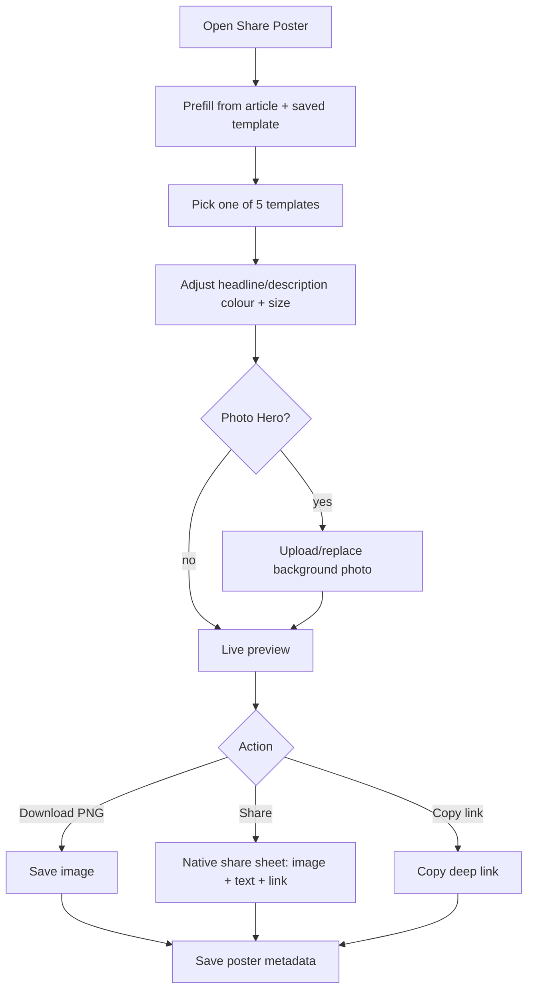

# R05 — Share Poster (Poster Template Editor)

## Metadata

| Field | Value |
|---|---|
| Page ID | R05 |
| Platforms | Mobile / Web |
| Roles | Reporter (owner), Admin (own scope), Super Admin (all) |
| Priority | P0 |
| Route / Path | Mobile: `Composer → Make poster`; Web: `/reporter/articles/:id/poster` |
| Prototype | `prototypes/pages/r05-share-poster.html` |

## Purpose

The Share Poster screen turns an article into a shareable **image poster** using
one of **5 built-in templates**, so that when a reporter shares a story to
WhatsApp, X, Facebook, or any other channel, the recipient receives a
ready-made graphic (headline + description + branding + link) rather than a bare
URL. It also gives per-field control over the **headline colour/size** and
**description colour/size**, an optional background photo, live preview,
download/export, and one-tap sharing. The chosen template and overrides are
stored on the article so the poster is reproducible and consistent.

## UI Structure

### Mobile

1. **Header** — back to `R02`, title "Share poster", right overflow (`⋮`) with
   "Reset", "Save as template".
2. **Preview stage** — full-width, `--background` backdrop, centered 4:5
   portrait poster (`radius-xl`, `shadow-md`). Pinch-to-zoom preview (optional).
3. **Template strip** — horizontal, scroll-snapping row of 5 template chips
   (Classic, Breaking, Minimal, Gradient, Photo Hero), selected chip `--purple`.
4. **Content fields** — headline (`TextArea`), description (`TextArea`), category
   tag (`TextInput`, uppercased).
5. **Headline style** — colour swatches + custom picker + font-size slider
   (18–46px) with live label.
6. **Description style** — colour swatches + custom picker + font-size slider
   (11–24px) with live label.
7. **Background photo** (Photo Hero template) — upload/replace/remove toggle.
8. **Sticky action bar** — "Download PNG" (secondary), "Share" (primary,
   opens native share sheet), "Copy link".

### Web

- Two-column layout: **left** = preview stage + download/copy row; **right** =
  scrollable control rail (Template, Content, Headline style, Description style,
  Share). Max content width 960px.
- Template picker renders as 5 labeled thumbnails (with mini mock-ups) instead
  of chips; the active thumbnail shows a `--purple` ring.
- Font-size uses a range slider with a numeric readout; colour uses native
  `<input type="color">` plus preset swatches.
- Share row: WhatsApp, X, Facebook, Copy link, More (Web Share API where
  available; otherwise copy + download fallback).

### Responsive behavior

- `xs` (0–390px): poster max-width 300px; sliders full width; share buttons
  wrap to two rows.
- `mobile` (0–768px): single column; preview sticky at top while controls scroll.
- `tablet` (769–1024px): two columns with narrower rail (280px).
- `desktop` (≥1025px): two columns, poster preview 380px.

### Template definitions (the 5 templates)

| # | Template | Look | Headline default | Description default |
|---|---|---|---|---|
| 1 | **Classic** | Solid brand `--purple` background, white text | White, 30px, 800 | `#f3d9ef`, 15px |
| 2 | **Breaking** | Solid `--error` red, white text, high urgency | White, 32px, 800 | `#ffe0e0`, 15px |
| 3 | **Minimal** | White background, purple top rule, purple headline | `--purple`, 30px, 800 | `--muted-strong`, 15px |
| 4 | **Gradient** | `--purple → --info` 150° gradient, white text | White, 30px, 800 | `#e5def2`, 15px |
| 5 | **Photo Hero** | Full-bleed background photo + dark gradient overlay | White, 30px, 800 | `#e0e0e0`, 15px |

Common poster anatomy (all templates): brand mark "newswatch" top-left,
category tag pill top-right, headline + description bottom-aligned, footer with
`newswatch.com` and the date.

## Features / Functional Requirements

| ID | Requirement | Priority |
|---|---|---|
| REQ-POSTER-001 | The screen MUST offer exactly 5 poster templates: Classic, Breaking, Minimal, Gradient, Photo Hero. | P0 |
| REQ-POSTER-002 | Selecting a template MUST update the live preview immediately. | P0 |
| REQ-POSTER-003 | The template MUST be pre-filled from the article's title, summary, category, and hero image. | P0 |
| REQ-POSTER-004 | The user MUST be able to set the **headline text colour** (presets + custom) and **font size** (18–46px). | P0 |
| REQ-POSTER-005 | The user MUST be able to set the **description text colour** (presets + custom) and **font size** (11–24px). | P0 |
| REQ-POSTER-006 | The user MUST be able to edit the poster headline, description, and category tag independently of the article fields. | P1 |
| REQ-POSTER-007 | The Photo Hero template MUST support uploading/replacing/removing a background photo. | P1 |
| REQ-POSTER-008 | The poster MUST render at 4:5 portrait and export at a minimum of 1080×1350px PNG. | P0 |
| REQ-POSTER-009 | The user MUST be able to download the poster as PNG and copy it to the clipboard. | P0 |
| REQ-POSTER-010 | Sharing MUST send the poster image **together with** the headline, description, and article link (deep link). | P0 |
| REQ-POSTER-011 | A back-link to the article detail, reset, and "save as article template" actions MUST be available. | P2 |
| REQ-POSTER-012 | Template + overrides MUST be saved on the article (`poster` metadata) and reloaded on return. | P1 |
| REQ-POSTER-013 | Poster generation MUST be accessible to the owning reporter; admins may generate for articles in their scope; super admin for any article. | P1 |
| REQ-POSTER-014 | The screen MUST show a loading state while the poster renders and an error state with Retry on failure. | P1 |

## User Interactions

- **Tap template chip/thumbnail** — preview swaps via cross-fade (`dur-medium`);
  colour/size controls reset to that template's defaults unless the user has
  overrides.
- **Drag size slider** — headline/description font size updates live; numeric
  label tracks the slider.
- **Pick colour swatch** — applies immediately; custom picker expands a colour
  panel.
- **Edit content fields** — poster text updates per keystroke (debounced for
  canvas export).
- **Upload background photo** — file picker; image is cropped/fitted with a drag
  -to-reposition handle and blur/darken toggle.
- **Download PNG** — renders the poster to canvas and saves; toast
  "Poster downloaded".
- **Share** — invokes the native share sheet (mobile) or Web Share API (web)
  with the image file attached plus text (headline + description + link);
  fallback sheets for WhatsApp/X/Facebook.
- **Copy link** — copies the article deep link; toast "Link copied".

## Validation & Error States

| Field/Action | Rule | Error message |
|---|---|---|
| Headline | Required for export; ≤120 chars | "Add a headline before exporting" |
| Description | Optional; ≤300 chars | "Description must be 300 characters or fewer" |
| Headline size | 18–46px | "Choose a size between 18 and 46" |
| Description size | 11–24px | "Choose a size between 11 and 24" |
| Background photo (Photo Hero) | ≤10MB; JPEG/PNG/WebP | "Images must be JPEG, PNG, or WebP and under 10MB" |
| Export | Render/canvas failure | "Couldn't create the poster. Try again." |
| Share | No share target available | "Sharing isn't available — download or copy instead." |

## Loading, Empty, Success States

- **Loading:** poster area shows a skeleton poster (`--background` shimmer) and
  a spinner while fonts/images load.
- **Empty:** if no article content, headline/description fields show
  placeholders and the poster shows the brand mark with a "Add a headline"
  hint.
- **Success:** export shows toast "Poster downloaded"; share opens the sheet and
  shows "Shared with poster attached".
- **Error:** inline error panel over the preview with "Retry".

## User Flow

1. Reporter finishes composing an article (R02) or opens Share on an existing
   article (R03/P09).
2. System opens R05 pre-filled with title, summary, category, and hero image,
   applying the article's saved template or the default (Classic).
3. Reporter picks a template, optionally tweaks headline/description colour and
   size, and edits content.
4. Reporter previews, then downloads or shares; the poster image + text are sent
   together.
5. Poster metadata is saved on the article.



## Dependencies

- **Screens:** R02 Article Composer, R03 My Articles, P09 Article Detail,
  R01 Reporter Dashboard.
- **Components:** `PosterCanvas`, `TemplatePicker`, `ColorSwatchPicker`,
  `SizeSlider`, `TextArea`, `ImageDropzone`, `ShareSheet`, `Toast`.
- **Services/stores:** `posterService` (canvas/HTML→image render),
  `mediaUploadService`, `shareService` (native/Web Share), `articlesStore`.
- **Backend endpoints:** `GET /api/v1/reporter/articles/:id`,
  `PATCH /api/v1/reporter/articles/:id` (poster + style metadata),
  `POST /api/v1/share/poster` (server-side render, optional),
  `POST /api/v1/media/sign`.

## API / Data Requirements

| Method | Endpoint | Purpose |
|---|---|---|
| GET | `/api/v1/reporter/articles/:id` | Load article + existing poster/style metadata |
| PATCH | `/api/v1/reporter/articles/:id` | Persist `poster` and `headlineStyle`/`descriptionStyle` |
| POST | `/api/v1/share/poster` | (Optional) server-side render high-res poster |
| POST | `/api/v1/media/sign` | Upload background photo (Photo Hero) |

Poster metadata payload:

```json
{
  "poster": {
    "template": "classic",
    "headlineColor": "#ffffff",
    "headlineSize": 30,
    "descColor": "#f3d9ef",
    "descSize": 15,
    "categoryTag": "INDIA",
    "bgPhotoMediaId": null
  },
  "headlineStyle": { "color": "#8a007a", "fontSize": 34, "weight": 800 },
  "descriptionStyle": { "color": "#555555", "fontSize": 17 }
}
```

## Navigation

| Action | From | To |
|---|---|---|
| Tap back | R05 | R02 Composer / P09 Article (origin) |
| Tap "Open full poster editor" | R02 | R05 |
| Tap "Share" | R05 | Native share sheet / target app |
| Tap article link (poster footer) | Shared poster | P09 Article Detail (deep link) |
| Tap "Download PNG" | R05 | Device downloads |

## Analytics Events

| Event | Trigger | Properties |
|---|---|---|
| `poster_opened` | R05 mount | `article_id`, `source` |
| `poster_template_selected` | Template change | `template` |
| `poster_color_changed` | Colour change | `field` (headline/description), `color` |
| `poster_size_changed` | Size change | `field`, `size` |
| `poster_downloaded` | Export success | `template`, `format` |
| `poster_shared` | Share invoked | `template`, `channel` |
| `poster_render_failed` | Export error | `reason` |

## Open Questions

- Client-side canvas rendering vs server-side rendering for pixel-perfect PNG
  export (fonts must be embedded either way)?
- Should the poster template be a per-article choice, a per-reporter default, or
  both (default with per-article override)?
- Do we restrict custom colours to brand-safe palettes, or allow any colour?
- Should we support landscape (16:9) and square (1:1) poster ratios in addition
  to 4:5, per channel?
- Do we add branded watermark/QR code (linking to the article) on every poster?
