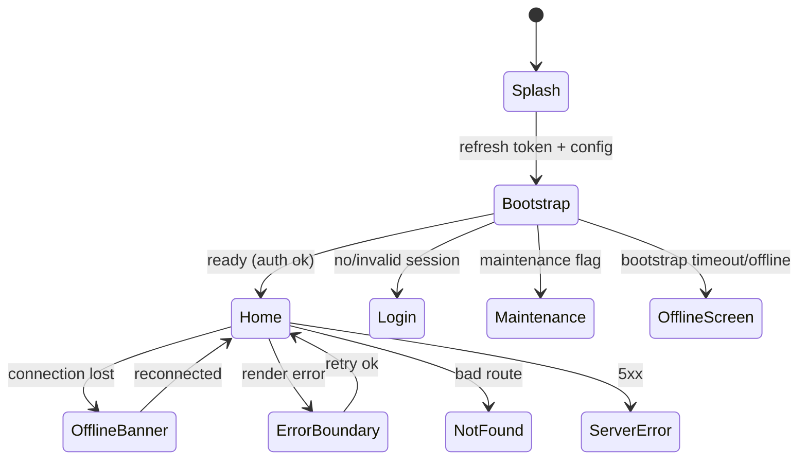

# S01 — System / Global States

## Metadata

| Field | Value |
|---|---|
| Page ID | S01 |
| Platforms | Mobile / Web |
| Roles | Guest / User / Reporter / Admin |
| Priority | P0 |
| Route / Path | Global (splash `/`, `/maintenance`, `/404`, `/500`, offline) |
| Prototype | `prototypes/web/s01-system-states.html` |

## Purpose

System States defines every cross-cutting, non-feature state a user can hit:
app bootstrap/splash, the network-offline banner, the global error boundary,
maintenance mode, and the 404/500 pages, plus the shared loading/empty
primitives used everywhere. Centralising these guarantees a consistent, calm
experience when things are slow or broken, prevents white screens, and gives
support a single vocabulary. Every page composes these primitives instead of
inventing its own.

## UI Structure

### Mobile
- **Splash / bootstrap:** full-screen `--purple` → `--purple-dark` gradient with
  the centered white logo mark (`logo-icon` 64px) and wordmark; a 3-dot
  `--white` loading pulse; minimum display 600ms; fades out `dur-slow`. Handles
  token refresh, config fetch, and font loading in parallel.
- **Offline banner:** 36px bar docked below the header, `--warning` background,
  white text "You're offline — showing cached content", with an optional
  "Retry" link. Slides down `dur-medium`; when the connection returns it
  switches to `--success` "Back online" for 2s then slides up.
- **Global error boundary:** replaces the crashed subtree with a centered
  `--error` alert icon, "Something went wrong", a short message, "Try again"
  (re-render) and "Go home" (P07). Never shows a stack trace.
- **Maintenance mode:** full-screen state: wrench/clock illustration, "We're
  under maintenance", an ETA line, and a "Retry" button; the header/bottom nav
  are hidden.
- **404 (mobile deep link):** "Page not found" with a "Go to Home" CTA.
- **500:** "Server error — we're on it" with Retry.
- **Primitives:** Skeleton (rect/circle/text shimmer), Spinner (`--purple`,
  24/40px), EmptyState (illustration + title + body + optional CTA),
  ErrorState (icon + title + body + Retry), Toast (`z-toast`).

### Web
- **Splash:** a lightweight boot screen (logo pulse) shown until hydration
  completes, capped at 600ms to avoid a flash on fast loads.
- **Offline banner:** a top-of-viewport slim bar (same tokens) that pushes
  content down; a "You're offline" tooltip appears near the header bell.
- **Error boundary:** centered card (`radius-xl`, `shadow-card`) with Retry
  and "Reload page"; route-level boundaries keep the shell (header/footer)
  intact.
- **404 / 500:** full-page centered states within the shell; web 404 includes
  popular links (Home, Categories, Search) for recovery and correct HTTP
  status codes for SEO.
- **Maintenance:** a 503-styled page with `Retry-After` support; admins can
  preview it.
- **Primitives** are shared components consumed by all web pages.

### Responsive behavior
- `xs`: illustrations scale down, CTA full-width.
- `mobile` (≤768px): banner docked under the purple header; splash full-bleed.
- `tablet` (769–1024px): centered states, banner full width.
- `desktop` (≥1025px): max 900px error cards, shell preserved for 404/500.

## Features / Functional Requirements

| ID | Requirement | Priority |
|---|---|---|
| REQ-SYS-011 | The app MUST show a branded splash during bootstrap and hide it once auth/config/fonts resolve or after a 6s timeout. | P0 |
| REQ-SYS-012 | The app MUST detect offline state and show a non-blocking offline banner with cached content. | P0 |
| REQ-SYS-013 | A global error boundary MUST catch unhandled render errors and offer Retry and Go Home without exposing stack traces. | P0 |
| REQ-SYS-014 | The app MUST support a server-driven maintenance mode that hides feature navigation. | P0 |
| REQ-SYS-015 | Missing routes MUST render a 404 state; web MUST return HTTP 404. | P0 |
| REQ-SYS-016 | Server failures MUST render a 500 state with Retry; web MUST return HTTP 500/503. | P0 |
| REQ-SYS-017 | The repo MUST provide shared Skeleton, Spinner, EmptyState, ErrorState, and Toast primitives. | P0 |
| REQ-SYS-018 | Splash MUST complete bootstrap (token refresh, remote config) before routing to avoid a login flash. | P0 |
| REQ-SYS-019 | The offline banner MUST auto-dismiss and confirm reconnection with a success state. | P1 |
| REQ-SYS-020 | Maintenance mode MUST be configurable with title, message, and ETA via remote config. | P1 |

## User Interactions

- **Splash:** no interaction; taps are ignored until ready; a 6s timeout routes
  to the offline/error fallback if bootstrap stalls.
- **Offline banner:** "Retry" re-checks connectivity immediately; the banner is
  dismissible for the session (it returns on the next offline event).
- **Error boundary Retry:** remounts the failed subtree; if it fails twice in
  30s, "Go home" is emphasised and an error report is queued.
- **Maintenance Retry:** re-fetches config; shows a pulse spinner; success
  routes to P07.
- **404 CTA:** "Go to Home" → P07; web also offers popular links.
- **Toast:** auto-dismiss 3s; swipe to dismiss; max one visible at a time.
- **Animations:** banner slide `dur-medium`; splash fade `dur-slow`; error card
  fade+scale-in 200ms.

## Validation & Error States

| Field/Action | Rule | Error message |
|---|---|---|
| Bootstrap | Must complete ≤6s | Falls back to Offline/Error screen |
| Token refresh | Network + valid refresh token | Routes to Login if refresh fails |
| Connectivity | Ping/config endpoint | Offline banner shown |
| Maintenance flag | `maintenance.enabled = true` | Maintenance screen |
| Route | Must exist | 404 state |
| 5xx | Server error | 500 state + Retry |
| Error report | Best-effort queue | Never blocks UI |

## Loading, Empty, Success States

- **Loading:** splash; skeletons for page content; `--purple` spinners for
  in-flight actions.
- **Empty:** the shared EmptyState primitive (illustration, message, optional
  CTA) used by every list.
- **Error:** ErrorState primitive (icon, message, Retry) and the global
  boundary.
- **Success:** banner "Back online" then dismisses; bootstrap routes to the
  correct start screen (P07 for users, R01 for reporters, A02 for admins).

## User Flow



1. App launches and shows the splash.
2. Bootstrap refreshes tokens, loads remote config, and checks maintenance.
3. On success the user lands on the correct home (P07 / R01 / A02).
4. If connectivity drops, the offline banner appears without unmounting the
   page.
5. A render error is caught by the boundary; the user can retry.

## Dependencies

- **Screens:** P07 Home, P03 Login, R01 Reporter Dashboard, A02 Admin Dashboard.
- **Components:** SplashScreen, OfflineBanner, ErrorBoundary, MaintenanceScreen,
  NotFoundState, ServerErrorState, Skeleton, Spinner, EmptyState, ErrorState,
  ToastProvider.
- **Services/stores:** `bootstrapService`, `connectivityService`,
  `errorReporter`, `remoteConfigStore`, `authStore`, `apiClient`.
- **Backend endpoints:** `GET /api/v1/config`,
  `GET /api/v1/app/version`, `POST /api/v1/client-errors`.

## API / Data Requirements

| Method | Endpoint | Purpose |
|---|---|---|
| GET | `/api/v1/config` | Remote config incl. `maintenance` and feature flags |
| GET | `/api/v1/app/version` | Min/latest version, force-update flag |
| POST | `/api/v1/client-errors` | Report caught errors (batched) |
| GET | `/api/v1/health` | Connectivity/health probe |

Response example:

```json
{
  "success": true,
  "data": {
    "maintenance": { "enabled": false, "title": "We're under maintenance", "message": "Back shortly.", "etaMinutes": 30 },
    "minAppVersion": "1.0.0",
    "forceUpdate": false,
    "flags": { "comments": true }
  },
  "meta": { "configVersion": 12 },
  "error": null
}
```

## Navigation

| Action | From | To |
|---|---|---|
| Splash ready (user) | S01 | P07 `/` |
| Splash ready (reporter) | S01 | R01 `/reporter` |
| Splash ready (admin) | S01 | A02 `/admin` |
| Splash no session | S01 | P03 `/login` |
| Error boundary "Go home" | any | P07 |
| Maintenance retry | S01 | P07 (on success) |
| 404 CTA | S01 | P07 |

## Analytics Events

| Event | Trigger | Properties |
|---|---|---|
| `app_bootstrap_start` | Launch | `platform`, `coldStart` |
| `app_bootstrap_end` | Ready | `durationMs`, `destination` |
| `offline_shown` | Banner appears | `page` |
| `offline_recovered` | Connection restored | `offlineSeconds` |
| `error_boundary_triggered` | Error caught | `component`, `messageHash` |
| `maintenance_shown` | Maintenance active | `configVersion`, `etaMinutes` |
| `not_found_view` | 404 rendered | `path` |
| `server_error_view` | 5xx rendered | `status`, `path` |

## Open Questions

- Should the offline banner block actions that require the network, or only
  inform?
- Is forced-update (hard block) needed in v1, or soft-prompt only?
- How long should client-error reports be retained/anonymised?
- Do admins get a preview toggle for maintenance mode in A02?
