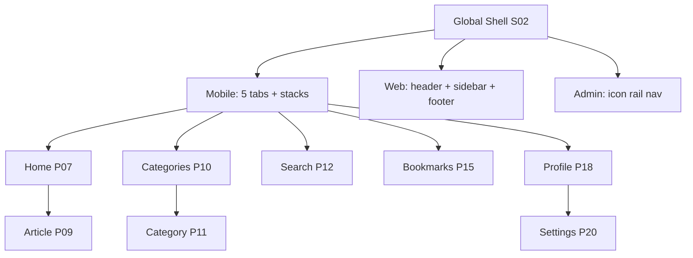

# S02 — Global Navigation Shell

## Metadata

| Field | Value |
|---|---|
| Page ID | S02 |
| Platforms | Mobile / Web / Admin |
| Roles | Guest / User / Reporter / Admin |
| Priority | P0 |
| Route / Path | Shell wraps all routes; mobile tabs; web header + sidebar |
| Prototype | `prototypes/web/s02-navigation-shell.html` |

## Purpose

The Navigation Shell is the persistent chrome around every page: the mobile
bottom tab bar and per-tab stacks, the web header (logo, nav, search,
login/profile), an optional web sidebar, and the admin console navigation. It
defines active states, deep-link and URL mappings, back behaviour, and badge
handling. Centralising navigation keeps movement predictable across platforms,
keeps the navigation map (flows/07) in sync, and gives deep links a single
authoritative route table.

## UI Structure

### Mobile — bottom tab bar
- 5 tabs, fixed height 56px + safe-area inset, `--white` with a top
  `--border`; shadow `shadow-sm` when content scrolls. Icon 24px over label
  (`font-size-meta`, 10–11px).
  | Tab | Route | Icon | Badge |
  |---|---|---|---|
  | Home | `/` (P07) | house | — |
  | Categories | `/categories` (P10) | grid | — |
  | Search | `/search` (P12) | search | — |
  | Bookmarks | `/bookmarks` (P15) | bookmark | — |
  | Profile | `/profile` (P18) | user | unread notifications dot |
- **Active state:** icon + label `--purple`, icon filled; inactive `--muted`.
  Transition `dur-fast`; a 150ms scale pop on selection.
- **Per-tab stacks:** each tab owns a stack; pushing a detail page keeps the
  tab bar visible (except fullscreen video and P16 sheet), and the tab retains
  its scroll position.
- **App header:** 62px; purple on primary tabs, white on detail pages, with
  back `‹` on push. The header is part of the shell, not each page.
- **Badges:** notification unread count on Profile (or a header bell).

### Mobile — back behavior
- Android hardware back: pops the current stack; at the stack root, switches to
  the previously selected tab; at the Home root, prompts "Press again to exit".
- iOS: edge-swipe back and the header `‹` behave identically.
- Opening a deep link builds the correct stack (e.g. `/article/:id` pushes P09
  over Home) so back returns to Home.

### Web — header
- 68px sticky header (`z-header`), white with `--border` bottom border:
  logo (`logo-icon` 34px) + wordmark, primary nav (Home, Categories, Search,
  About) with hover `--purple`, a 230px×40px search box, and right-side
  actions (bell with unread badge, Login button for Guests / avatar menu for
  users).
- **Avatar menu:** Profile, Bookmarks, Settings, Reporter Dashboard (if
  reporter), Admin console (if admin), Log out. Reporter/admin/super_admin
  accounts see role-specific entries; the admin console exposes
  super-admin-only pages only when the viewer is a super_admin.
- **Scroll state:** header gains a subtle `shadow-sm` after 8px scroll.
- **Optional sidebar:** ≥1025px on content-heavy sections, a left rail (240px)
  can show category shortcuts or more links; collapsible and remembered.
- **Footer:** logo, nav columns (Company, Categories, Legal), social icons,
  language "English", copyright — links map to P10/P12/P21.

### Web — admin console nav
- Separate layout: collapsed icon rail (72px) expandable to 240px, `--text`
  dark or `--white` theme, items: Dashboard (A02), Moderation (A03),
  Categories (A04), Users (A05), Reporter Approvals (A06), Analytics (A07).
- Active item uses a `--purple` left bar and `--purple-light` background;
  admin bell shows pending-queue counts; a "View site" link returns to the
  reader web.

### Responsive behavior
- `xs`: labels optional (icons only if width tight); tab bar 52px.
- `mobile` (≤768px): bottom tabs; web-style header hidden.
- `tablet` (769–1024px): web header with condensed nav; sidebar collapsed.
- `desktop` (≥1025px): full header + optional sidebar; admin rail expanded.

## Features / Functional Requirements

| ID | Requirement | Priority |
|---|---|---|
| REQ-SYS-021 | Mobile MUST present a 5-tab bottom bar (Home, Categories, Search, Bookmarks, Profile) with active states. | P0 |
| REQ-SYS-022 | Each tab MUST maintain its own navigation stack and scroll position. | P0 |
| REQ-SYS-023 | Web MUST present a sticky header with logo, nav, search, and auth/profile actions. | P0 |
| REQ-SYS-024 | The shell MUST render an unread notification badge. | P0 |
| REQ-SYS-025 | Back behaviour MUST be consistent: pop stack → previous tab → exit prompt. | P0 |
| REQ-SYS-026 | The shell MUST map every deep link/URL to the correct route and stack. | P0 |
| REQ-SYS-027 | Guest header MUST show Login; authenticated header MUST show the avatar menu. | P0 |
| REQ-SYS-028 | The admin console MUST use a distinct nav with moderation/badge counts. | P1 |
| REQ-SYS-029 | The web shell SHOULD offer an optional collapsible sidebar on desktop. | P2 |
| REQ-SYS-030 | The shell MUST hide chrome for fullscreen video and immersive sheets, restoring it on exit. | P0 |
| REQ-SYS-031 | Nav MUST be i18n-ready and driven by a single route registry. | P1 |

## User Interactions

- **Tab tap:** switches tab with a 150ms icon pop and cross-fade of content;
  re-tapping the active tab scrolls its stack to the top (or pops to root).
- **Header logo tap:** returns to Home root.
- **Search box focus (web):** expands to the search overlay (P12).
- **Bell tap:** opens notifications dropdown/page (P17).
- **Avatar menu:** opens a `--shadow-md` dropdown; items navigate with a fade.
- **Hover (web):** nav links underline/colour `--purple`; header shadow
  appears.
- **Sidebar toggle (web):** animates width 200ms; state persisted.
- **Fullscreen video:** shell chrome fades out (`dur-medium`) and fades back on
  exit; device back exits fullscreen first.
- **Android back at root:** double-press-to-exit toast "Press back again to
  exit."

## Validation & Error States

| Field/Action | Rule | Error message |
|---|---|---|
| Route resolution | Path in registry | Fallback to 404 (S01) |
| Role access | Route allowed for role | Redirect to P07 with "You don't have access" |
| Deep link | Build valid stack | Malformed link → P07 |
| Badge count | Non-negative | Capped at 99+ |
| Tab switch | Stable state | N/A |
| Auth expiry | Refresh or logout | Redirect to P03 with return URL |

## Loading, Empty, Success States

- **Loading:** the shell renders immediately with tab bar/header so navigation
  never blocks; page content shows skeletons.
- **Empty (badge):** badge hidden when count = 0.
- **Error:** unknown route → 404 inside the shell; role-denied → redirect with
  a toast.
- **Success:** active tab/route reflected, badges accurate, back returns to the
  expected screen, deep links resolve.

## User Flow

1. App boots (S01) and mounts the shell.
2. The shell reads the route registry and current session to render chrome and
   the initial route.
3. The user switches tabs or follows a deep link; the shell builds the stack.
4. Detail pages push over the current tab; back pops.
5. Ends wherever the user navigates; chrome stays consistent.



### URL mapping table

| Route | Page | Platforms |
|---|---|---|
| `/` | P07 Home Feed | M, W |
| `/article/:id` | P09 Article Detail | M, W |
| `/categories` | P10 Categories | M, W |
| `/categories/:slug` | P11 Category Listing | M, W |
| `/search` | P12 Search | M, W |
| `/search?q=` | P13 Search Results | M, W |
| `/bookmarks` | P15 Bookmarks | M, W |
| `/article/:id/comments` | P16 Comments | M, W |
| `/notifications` | P17 Notifications | M, W |
| `/profile` | P18 Profile | M, W |
| `/reporter/:id` | P18 Public Reporter | M, W |
| `/profile/edit` | P19 Edit Profile | M, W |
| `/settings` `/settings/:section` | P20 Settings | M, W |
| `/about` `/contact` `/privacy` `/terms` `/faq` | P21 Static | M, W |
| `/reporter` | R01 Reporter Dashboard | M, W |
| `/admin` `/admin/*` | A01–A07 Admin | A |
| `/maintenance` `/404` `/500` | S01 States | M, W |

## Dependencies

- **Screens:** all pages (P01–P21, R01–R04, A01–A07).
- **Components:** BottomTabBar, TabIcon, AppHeader, WebHeader, AvatarMenu,
  NotificationBell, Sidebar, Footer, AdminNav, RouteRegistry, ProtectedRoute.
- **Services/stores:** `navigationStore` (route/stack), `authStore`,
  `notificationStore`, `remoteConfigStore`, `analytics`.
- **Backend endpoints:** `GET /api/v1/notifications/unread-count`,
  `GET /api/v1/config` (nav/feature flags).

## API / Data Requirements

| Method | Endpoint | Purpose |
|---|---|---|
| GET | `/api/v1/notifications/unread-count` | Badge count |
| GET | `/api/v1/config` | Feature flags controlling nav items (e.g. sidebar) |
| GET | `/api/v1/categories?limit=6` | Sidebar category shortcuts (web) |

Response example:

```json
{
  "success": true,
  "data": {
    "tabs": ["home", "categories", "search", "bookmarks", "profile"],
    "flags": { "sidebar": true },
    "unreadCount": 5
  },
  "meta": {},
  "error": null
}
```

## Navigation

| Action | From | To |
|---|---|---|
| Home tab | any | P07 `/` |
| Categories tab | any | P10 `/categories` |
| Search tab | any | P12 `/search` |
| Bookmarks tab | any | P15 `/bookmarks` |
| Profile tab | any | P18 `/profile` |
| Header search | any web | P12 `/search` |
| Bell | any | P17 `/notifications` |
| Avatar → Settings | header | P20 `/settings` |
| Avatar → Admin | header (admin) | A02 `/admin` |
| Re-tap active tab | any tab | Scroll to top / pop to root |
| Android back (root) | any tab | Exit prompt |

## Analytics Events

| Event | Trigger | Properties |
|---|---|---|
| `nav_tab_select` | Tab tapped | `tab`, `previousTab` |
| `nav_deep_link` | Deep link opened | `path`, `resolvedPage` |
| `nav_back` | Back used | `from`, `to` |
| `nav_search_focus` | Search focused | `platform` |
| `nav_notifications_open` | Bell tapped | `unreadCount` |
| `nav_sidebar_toggle` | Sidebar toggled | `collapsed` |
| `nav_admin_section` | Admin nav item | `section` |

## Open Questions

- Should Home be a tab plus a "Following" surface, or separate?
- Is a web sidebar in v1 or deferred to P2?
- Do reporters get a distinct mobile tab, or access via Profile?
- Should the Search tab open P12 with the keyboard focused, or the search overlay?
